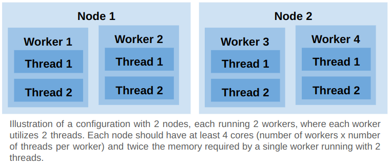

# 3DCS

Runs a [3DCS](https://www.3dcs.com/) Monte Carlo simulation or contributor analysis
(sensitivity) of a model stored in a cloud bucket, split over N workers submitted as
SLURM jobs on a cluster where 3DCS is installed (under Wine), then merges the workers'
results into one and uploads everything back to the bucket. It meters the node hours
3DCS used against the organization's allocation. Like `activate-batch` it registers
**no endpoint**: the run completes when the merge is uploaded and fails when any
worker, the merge or an upload fails.

## Inputs

| Group | Input | Meaning |
|---|---|---|
| `cluster` | `resource` | SLURM cluster with 3DCS (`/dcs`, Wine module) |
| `cluster.slurm` | `partition`, `time`, `scheduler_directives` | applied to every worker and to the merge; `#SBATCH --exclusive` (default) gives every worker a whole node |
| `service` | `dry_run` | generate the macro scripts and run every step except 3DCS itself |
| | `version` | 3DCS version: one `app/dcs_environment/<version>.sh` per installed version |
| | `analysis_type` | `montecarlo` (needs `num_seeds`) or `sensitivity` |
| | `bucket`, `model_directory` | the model: a directory with exactly one `.wtx` file and every file it references |
| | `output_directory` | where the outputs go, in the same bucket (must not be inside `model_directory`) |
| | `concurrency` | number of workers, 1–40 (one SLURM job each) |
| | `thread` | 3DCS threads per worker |
| | hidden | `metering_user`, `metering_ip`, `org_name`, `run_hours_3dcs_group`, `monitoring_conda_dir`, `monitoring_conda_env` |

Hidden inputs carry the deployment's constants (the metering server, the allocation
group, where the monitoring conda environment lives) and only change with the
deployment.

## How it works

```
workspace_preprocessing ─► preprocessing ─┬─► workers-1..N ─► merge
   (user workspace)        (login node)   ├─► estimate_end_time
                                          └─► usage_metering (user workspace)
```

1. **workspace_preprocessing** runs in the user workspace: it checks that the
   organization group still has 3DCS allocation hours (the platform API key is only
   available there) and raises `sshd`'s `MaxSessions` on the cluster, which the executor
   needs to multiplex the steps of many parallel workers.
2. **preprocessing** runs on the login node: checkout, `inputs.sh`, `controller.sh`
   (creates the conda environment of the CPU/memory monitor and takes ownership of the
   Wine prefix, both idempotent), downloads the model from the bucket, rewrites the
   paths inside the `.wtx` so they point at the downloaded files
   (`adapt_wtx_paths.py`), and assembles one `job_dir_<n>/run_case.sh` per worker
   from `inputs.sh` + `dcs_environment/<version>.sh` + `macros/<analysis_type>.sh` +
   `worker-template.sh`.
3. **workers** is a guarded static matrix (1–40, `max-parallel` = concurrency): each
   worker submits its script through `script_submitter` as a SLURM job. The script
   writes `macroScript.txt`, starts the CPU/memory monitor and the metering heartbeat,
   runs `dcsSimuMacro.exe` under Wine, checks that the result file
   (`Results/<model>_<n>.hst` or `.hlm`) exists, uploads its directory to the bucket
   and records its exit status in `run_case.exit`, which the job checks (3DCS itself
   returns -3 even on success, and the submitter never inspects exit codes).
4. **estimate_end_time** prints a completion estimate every two minutes from the
   `progress on mthreadIndex` lines of the workers' 3DCS logs, until every worker has
   finished.
5. **merge** collects the workers' result files from the shared job directory, merges
   them with the corresponding `macros/merge_<analysis_type>.sh` macro
   (`merge-template.sh`, also a SLURM job), removes the per-worker copies, uploads
   `Results/`, `TempData/` and `merge.sh`, and finally cancels `usage_metering`. With
   one worker there is nothing to merge and the job only cancels the metering.

## Outputs

`<bucket>/<output_directory>/<user>/<workflow>/<run number>/`:

```
job_dir_<n>/      each worker's directory: Results/<model>_<n>.hst|hlm, dcs-runtime-<n>.txt,
                  TempData/ (3DCS logs), case-<n>-<node>-jobid-<id>.{txt,png} (CPU/memory),
                  macroScript.txt, run_case.sh, run.<id>.out
Results/          the merged results (<model>.hst|hlm and the saved rsh/rel/csv/html/raw/dev/hsu reports)
TempData/         the merge's 3DCS logs
merge.sh
```

The job directory on the login node (`~/pw/jobs/<workflow>/<run number>/`) keeps the
downloaded model and the same files; `logs/<job>/step_N/step.out` has every step's
trace.

## Node utilization

`#SBATCH --exclusive` is the default: every worker occupies a whole node. Remove it
from the SLURM directives to pack several workers on one node, e.g. two nodes, four
workers, two threads per worker:



Threads multiply the memory a worker needs. The monitor cancels a worker's SLURM job
when the node's memory use exceeds 98%.

## Usage metering

3DCS usage is metered in **node hours**: two nodes running 3DCS for 10 hours count 20
hours, however many workers or threads each node runs — so to minimize license usage,
fit as many workers as possible on a node.

- Every worker appends a timestamp every 30–60 s to
  `usage/<node>-<run slug>` in the job directory (the merge to `…-merge`); the
  workers on one node share the file, and the last one to finish moves it to
  `usage_completed/`.
- The **usage_metering** job, in the user workspace, syncs `usage/` from the cluster
  every minute and pushes it to `<metering_user>@<metering_ip>:~/.3dcs/usage-pending`
  (the workspace holds that server's SSH key). A retired file is never sent again, so
  the heartbeats written after the last sync (up to a minute) are not counted, and a
  job shorter than the sync interval, such as a merge of a few seconds, may never
  reach the server.
- On the metering server, the daemon [`metering-server/update-3dcs-usage.py`](metering-server/update-3dcs-usage.py)
  polls `usage-pending/` every six minutes: a file that stopped growing since the
  previous poll is a finished worker, its first-to-last timestamp span is added to the
  group's used allocation (`PATCH /api/organizations/<org>/groups/<group>/allocations`)
  and the file moves to `usage-processed/`. It logs to `~/.3dcs/update-3dcs-usage.log`;
  a second instance exits at once (file lock).

`workspace_preprocessing` refuses to start a run when the group's balance
(`allocations.total - allocations.used`) is zero or negative, and when the daemon is
not running as `<metering_user>` on the metering server (or the server is unreachable).

### Deploying the metering daemon

Once per metering user (`honda` for this variant), on the metering server:

1. Copy [`metering-server/update-3dcs-usage.py`](metering-server/update-3dcs-usage.py)
   and [`metering-server/update-3dcs-usage.sh`](metering-server/update-3dcs-usage.sh)
   to the user's home directory.
2. Create `~/.3dcs/env` (mode `600`) with the platform host and an API key allowed to
   update the organization's group allocations:

   ```bash
   export PW_PLATFORM_HOST=cloud.parallel.works
   export PW_API_KEY=...
   ```

3. Start it, and keep it started across reboots:

   ```bash
   ~/update-3dcs-usage.sh                                   # prints the pid, or that it already runs
   (crontab -l 2>/dev/null; echo "@reboot ${HOME}/update-3dcs-usage.sh") | crontab -
   ```

`pgrep -u "$(id -u)" -f 'update-3dcs-usage[.]py'` is the liveness check the workflow
uses; `tail ~/.3dcs/update-3dcs-usage.log` shows what it processed and every
allocation update with the API's HTTP status.

## Dry run

With **Dry run?** the workers and the merge print their `macroScript.txt`, touch
empty result files and upload them, and skip 3DCS, the monitor and the metering
heartbeat. Everything else (balance check, transfer, SLURM submission, merge assembly,
uploads) runs for real.

## Testing

```bash
python3 tools/tests/run-workflow-test.py workflows/3dcs/tests/general/3dcsv3-montecarlo-dry-run.json
python3 tools/tests/run-workflow-test.py workflows/3dcs/tests/general/3dcsv3-montecarlo.json
```

Both run the `Rail_CM` training model of the `s33dcshonda` bucket with two workers of
two threads on the `c5-2xlarge` partition of `3dcsv3`; the real one takes about 15
minutes. Pass = the run completes and no SLURM job is left. Results, per the repo
convention, are in the CSV next to each test.

## Provenance

Ported from `parallelworks/dcs-workflow` (`honda-japan.yaml` at `v4-dev`), where it
was registered as `3dcsv4`. Changes made in the port, beyond the repository layout
(`app/`, `inputs.sh`, `controller.sh`, `cluster`/`service` input groups):

- Workers and the merge record their exit status and the jobs check it; a missing
  result file fails the run instead of silently merging fewer results.
- The merge reads the workers' results from the shared job directory instead of
  downloading every worker directory back from the bucket, and loads the model by
  its absolute path (the relative `DCSLOAD` never found the `.wtx`: `fail in open
  File` in every merge log).
- Bucket uploads land at `<run>/job_dir_<n>/…` and `<run>/Results/…` instead of
  `job_dir_<n>/job_dir_<n>/…` and `Results/Results/…`, and are retried.
- Heartbeat files are named after the run slug (unique for inline runs too), workers
  sharing a node no longer retire the node's file while another worker is still
  running, and the metering job waits for the cluster-side directories to exist.
- The memory guard of the monitor works again (it cancels `$SLURM_JOB_ID`; the file
  it looked for no longer exists in this design).
- `estimate_end_time` ends by itself when the workers finish; the dry-run no longer
  swaps script files around.
