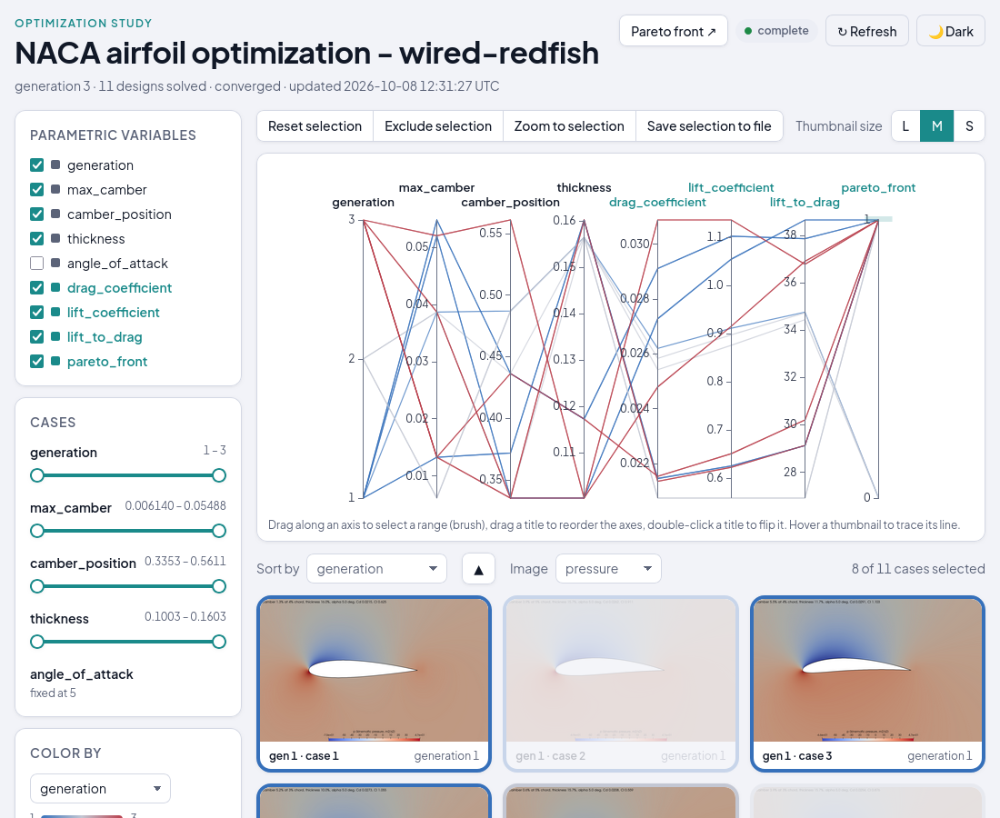

# Dakota-OpenFOAM Optimization

NACA airfoil shape optimization as a loop of two standalone workflows:

| Piece | Workflow | Called by |
|---|---|---|
| propose designs or stop | [`workflows/dakota`](../dakota/README.md) | the `optimize` job of `iteration-naca.yaml` |
| solve one design | [`workflows/openfoam-naca`](../openfoam-naca/README.md) | the `workers` matrix of `iteration-naca.yaml`, once per design |
| explore the designs (optional) | [`workflows/design-explorer`](../design-explorer/README.md) | `preprocessing`, with images on |

Their READMEs describe the optimizer, the evaluator, the page and their inputs;
this one covers only the loop, the live pages and the tests. The loop mechanics come from
[`tutorials/optimization`](../../tutorials/optimization/README.md).

## How the pieces connect


```
general-naca.yaml
 ├─ preprocessing       state/ (the study); checks that the OpenFOAM and Dakota environments deliver
 │                      their tools; starts pareto-server.py detached under pw endpoints run, then waits
 │                      until the endpoint is listed and /healthz answers through the platform; with
 │                      images on, calls design-explorer for the second page
 ├─ stop_server_if_unhealthy   if: !completed — removes the Pareto server if its endpoint never came up
 └─ optimization_loop   needs the endpoint, then:
     ├─ Iterate         retried step; each attempt runs iteration-naca.yaml once:
     │                    optimize ──▶ workers-1..batch_size ──▶ decide
     │                    dakota step   openfoam-naca   exit 1 = next cycle, exit 0 = done
     └─ Report          if: always — verdict from state/status, the page URL
```

The two subworkflows only share files under `state/`:

1. `optimize` calls the Dakota step with the problem, the knobs and
   `state_dir`; the step ingests `iter_<N-1>/case_*/{results.out,exit_code}`
   and writes `iter_<N>/case_<j>/params.in` plus `proposal.env`, which the next
   step publishes as outputs.
2. `workers` is a matrix of `batch_size` slots (a literal list of 8 sliced at
   submission); slot *j* runs when `j <= N_CASES` and calls the OpenFOAM workflow
   with `case.params_file = ITER_DIR/case_j/params.in` and
   `case.case_dir = ITER_DIR/case_j`; the cluster, mesh, angle and environment
   settings pass straight through. The call leaves `results.out` or `exit_code`
   in that directory.
3. `decide` turns `state/status` into the exit code the parent's retry loops on.

Every case is therefore exactly a standalone `openfoam-naca` run: its own
checkout and environment check (lock-serialized install), its own submitter job,
and a `case/case.foam` that opens in ParaView, for every design of every
generation.

### Compared with the single-app version

The loop, batching, convergence and failure handling are unchanged. What moved:
`optimizer.py`, `driver.py` and `install-dakota.sh` to `workflows/dakota/app`
(problem-agnostic now), the OpenFOAM files to `workflows/openfoam-naca/app`,
`prepare-env.sh` and the Miniforge bootstrap to `tools/utils/`. The OpenFOAM
workflow writes the `case.sh` that records `exit_code`, where the driver used
to. Each worker is a three-job subworkflow instead of one submitter call,
roughly 10 s more per case on the login node. The installs are separate
prefixes (`openfoam-naca/miniforge`, `dakota/miniforge`). This directory has
no `app/`: preprocessing checks out `workflows/dakota/app` for the server, plus
`workflows/openfoam-naca/app` and `tools/utils` to make both environment checks
once before the loop starts. Environment commands that do not deliver the tools
(a site module that only sets a variable) fail the run there, with the tools'
own output; left to the workers, the loop re-proposed the generation once and
ended `FAILED` with nothing but "no case ran" at the top level.

## The live Pareto front

`pareto-<run slug>` (in `pw endpoints list` and on the run page) is
`workflows/dakota/app/pareto-server.py` serving the study directory: every
evaluated design plotted as drag against negative lift, the front highlighted,
and `max_camber`, `camber_position`, `thickness`, generation, case and both
objectives on hover. It reads the files on every request and the page polls
every 10 s until the status is final, so a tab left open on a long run costs
one small request per refresh and nothing afterwards.

The server only ever runs on the login node, so preprocessing starts it
detached (`setsid pw endpoints run ...`, as in
[`tutorials/endpoint-workflows` Stage 3](../../tutorials/endpoint-workflows/README.md))
instead of through `script_submitter`, and its last step calls the
`wait_for_endpoint` subworkflow to check that the endpoint is listed and
`/healthz` answers; the loop needs preprocessing, so the page is live from the
first generation and a server that cannot start fails the run before any case
is spent. **The endpoint outlives the run**: after
the optimization finishes, or after a cancel, it keeps showing the final front
until you delete it. **Deleting the session cleans up its processes**:
`pw endpoints delete pareto-<run slug>` kills `pw endpoints run` and the server
under it. The one case the workflow handles itself is a server whose endpoint
never became healthy (it is not listed, so it cannot be deleted):
`stop_server_if_unhealthy` kills it by pid. A cancel mid-generation kills the
running cases and SLURM jobs and leaves only the endpoint.

## Design Explorer (optional)

Turn on **Generate images and serve Design Explorer?** (off by default) and every
case renders its flow fields with ParaView, and a second endpoint,
`design-explorer-<run slug>`, serves the study next to the Pareto front:



- One axis per design variable and coefficient, plus **generation** and
  **pareto_front** (1 for the designs no other design beats on both drag and
  lift). Brush `pareto_front` to see the front's designs and their images.
- Lines and thumbnails are colored by generation, so the search's progress
  shows at a glance. The angle of attack is fixed, so its axis starts hidden.
- A case appears as soon as it solved; the page follows the study until
  Dakota's status is final. **Pareto front ↗** opens the other page.

[`workflows/design-explorer`](../design-explorer/README.md) serves the page, and
its README describes it. ParaView comes from **ParaView environment commands**
or, left empty, from the official binaries downloaded once; rendering adds
about 5 s per case. The endpoint outlives the run like the Pareto one, and the
design-explorer workflow removes its server when the endpoint never answers.

## Running it

Pick the resource, set `max_iterations`, `batch_size`, `stall_generations` and
`mesh_scale`, and choose login node or scheduled cases with `Cores per case`
(the solver caps the ranks at one per 1,000 cells, so 16 cores need `mesh_scale`
2 or more; preprocessing warns when a request exceeds that, and the openfoam-naca
README has the measurements).
The **Design Problem** group holds the angle of attack, the variable bounds
(keep the three names) and the Dakota seed. The form's defaults are the demo:
login node, `mesh_scale` 2, 4 × 10, about 20 min. **Load saved inputs →
`mesh3_slurm_4ranks`** is the converged-mesh study: SLURM, 4 ranks per case,
`mesh_scale` 3, 8 × 10, 31 min on gcpsmall.

The run succeeds only when the optimizer wrote `CONVERGED`. The front is
`state/pareto.csv` and `state/pareto.svg` in the run's job directory, every
case under `state/iter_<N>/case_<j>/`, the history on the page and in
`state/evaluations.csv`. The retried `Iterate` step shows only its last
attempt; each worker's log is three jobs deep (`workers-<k>` → `preprocessing`,
`run_case`, `results`). `iteration_timeout` (default 2d) caps one generation
because the platform's default retry timeout is 30 s per attempt.

## Variants

`yamls/hsp-naca.yaml` with `yamls/iteration-naca-hsp.yaml` is the HSP
(`activate.hpc.mil`) loop, `yamls/noaa-naca.yaml` with
`yamls/iteration-naca-noaa.yaml` the NOAA (`noaa.parallel.works`) one: the same
loop and server, with the platform's form (the resource as the top-level input;
SLURM account, QoS and, on HSP, node type for on-prem `existing` resources; the
PBS account on HSP) passed through an iteration that calls the matching variants
of the two workflows. What those variants change is in their READMEs: the module
hint for HPCMP systems (DSRC OpenFOAM modules only set `foamDotFile`, so the HSP
forms save a `nautilus_modules` configuration with the module load and the
`source $foamDotFile` it asks for, plus `mesh_scale` 4 for the loop; every form
defaults to `mesh_scale` 2, the floor at which 16 ranks are all used; not every
login node reaches the internet),
the shared install directory on NOAA, and how each submitter receives the
case's core request.

## Tests

`tests/general-naca/` (the variant is the YAML's basename): `gcpsmall.json`
(login node, 4 × 4), `gcpsmall-slurm-mpi2.json` (SLURM, 2 ranks) and
`gcpsmall-mesh3-slurm-4ranks.json` (the saved configuration) and
`gcpsmall-images.json` (login node, 4 × 3, images and Design Explorer);
`tests/hsp-naca/` and `tests/noaa-naca/` repeat the first two and the images
test for the variants. The runner checks the endpoints and deletes them. Run with
`python3 tools/tests/run-workflow-test.py <test.json>`.
