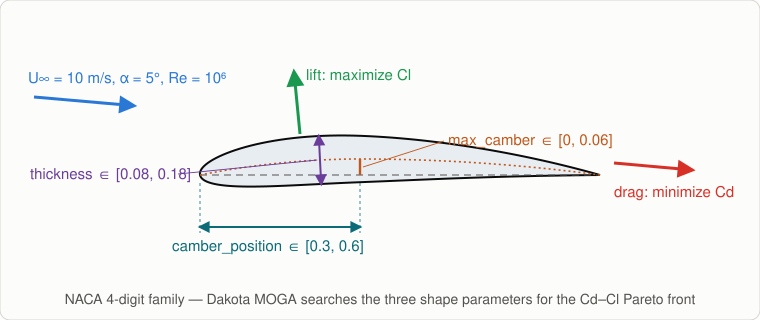

# Dakota-OpenFOAM Optimization

**[Dakota](https://dakota.sandia.gov)'s MOGA driving [OpenFOAM](https://www.openfoam.com)
simulations** as an iterative ACTIVATE workflow: each iteration Dakota proposes a
batch of designs, the platform evaluates them as parallel OpenFOAM cases on the
cluster (login node or one scheduler job per case), and the loop repeats until
Dakota converges, the front stagnates, or the budget runs out.

This is the swap that [`tutorials/optimization`](../../tutorials/optimization/)
describes in its last section, made real. The loop mechanics (retry-as-loop,
guarded static matrix, file contract, failure semantics) are the tutorial's —
read its README for the *why* of every piece. This README covers only what changed.

## The example problem

**NACA 4-digit airfoil shape optimization** — the textbook aerodynamic design
problem. Each case is turbulent flow (Re = 10⁶, Spalart-Allmaras) over an airfoil
at 5° incidence on a structured C-grid generated per design, solved with
`potentialFoam` + `simpleFoam` in ~10 s at the default mesh (~5k cells).

| | |
|---|---|
| Design variables | `max_camber` ∈ [0, 0.06] · `camber_position` ∈ [0.3, 0.6] · `thickness` ∈ [0.08, 0.18] (chord fractions; the box covers the classic 4-digit family — 0012, 2412, 4412, …) |
| Objectives (both minimized) | `drag_coefficient` · `neg_lift_coefficient`, from OpenFOAM's `forceCoeffs` function object |
| Cost dial | `mesh_scale` multiplies every cell count; the iteration cap and relaxation adjust with it, so cost grows roughly with the cube — from seconds-cheap to genuinely expensive (table below) |
| Cores dial | `cores_per_case` — MPI ranks per case: 1 runs the solvers serially, more decomposes the mesh and runs them under `mpirun` (below) |

More camber buys lift but costs drag, thickness costs drag at similar lift: the
loop maps that tradeoff as a Pareto front of airfoil shapes (`state/pareto.csv` +
`state/pareto.svg` in the run's job directory).

### Mesh fidelity: cost and accuracy

Measured on one gcpsmall core for the reference design (NACA 2412 at α = 5°):

| `mesh_scale` | cells | time per case | Cd | Cl |
|---:|---:|---:|---:|---:|
| 1 | 5.4k | ~10 s | 0.0222 | 0.722 |
| 2 | 21.6k | ~1 min | 0.0193 | 0.718 |
| 3 | 48.6k | ~3.5 min | 0.0190 | 0.707 |
| 4 | 86.4k | ~10 min | 0.0194 | 0.698 |
| 6 | 194k | ~35 min | 0.0206 | 0.684 |

Discretization is essentially converged by scale 3–4 (Cl within ~2%, Cd within
~6% of the scale-6 values). Scale 1 is the demo setting: ~10% high on drag and
nearly thickness-blind (friction-dominated), but fast enough to watch the loop
work end-to-end. The remaining gap to wind-tunnel data for this airfoil
(Cl ≈ 0.74, Cd ≈ 0.010) is model error, not mesh: fully-turbulent
Spalart-Allmaras with wall functions resolves no laminar-turbulent transition,
which roughly doubles the absolute drag at this Reynolds number. Treat the
coefficients comparatively — ranking designs, which is all the optimizer needs —
rather than as absolute predictions.

### Cores per case: when MPI pays off

`cores_per_case` = N > 1 makes `simulator.sh` write a `decomposeParDict` that
cuts the mesh into N strips along the chord (`hierarchical`, `n (N 1 1)`),
`decomposePar` it and run `potentialFoam` and `simpleFoam` as
`mpirun --bind-to none -np N <solver> -parallel` (the `forceCoeffs` output still
lands in `case/postProcessing`, so no `reconstructPar` is needed for the
objectives). Measured on gcpsmall's login node, same reference design:

| `mesh_scale` | cells | 1 core | 2 ranks | 4 ranks |
|---:|---:|---:|---:|---:|
| 1 | 5.4k | 6.5 s | 5.9 s | 13 s |
| 2 | 21.6k | ~1 min | — | 24 s |

At the default mesh decomposition buys nothing — 1.3k–2.7k cells per rank is all
halo exchange — so the default stays 1. Two to four ranks start paying from
`mesh_scale` 3–4 (~15k+ cells per rank; at scale 3, 4 ranks take ~1.5 min per
case against ~3.5 min serial) and the ranks' answers agree with the serial ones
to within 0.5% on Cd and 0.05% on Cl. `--bind-to none` matters on the login node,
where `batch_size` launchers start at once: bound to cores, they would all pin
their ranks to the same first cores.

Why strips and not scotch: the conda-forge scotch partitions this mesh
differently on every `decomposePar` call, and the SIMPLE loop on the C-grid is
marginal enough at the default mesh that a design then converges or diverges by
the draw (1 divergence in 30 runs on the login node; the compute nodes, a
different CPU, lost 4 of ~33 cases in one run). Strips are deterministic — every
repeat reproduces the coefficients to all printed digits — and converged for
every design tried, including the two that diverged under scotch and the
high-camber corner of the box. `export DECOMP_METHOD=scotch` in the OpenFOAM
environment commands restores the graph partitioner.

### Watching a case run

Each worker's log (the streamed `run.*.out`) shows every OpenFOAM step: the
short ones (`blockMesh`, `decomposePar`, `potentialFoam`) in full, and for
`simpleFoam` one progress line every 50 iterations — iteration, pressure
residual, current Cd and Cl from the `forceCoeffs` function object — plus the
solver header, its convergence or crash messages, and the final averaged
coefficients. The complete solver log stays in `case/log.simpleFoam` next to the
other `log.*` files; `export STREAM_EVERY=0` in the OpenFOAM environment commands
streams it whole, another value changes the cadence.

Where the ranks run:

- **Login node** (`Schedule Cases?` off): `batch_size × N` ranks share the node —
  keep the product at or below its core count.
- **Scheduled**: each case job asks for `--nodes=1 --ntasks=N` (PBS:
  `-l select=1:ncpus=N:mpiprocs=N`), placed *ahead* of the form's directives so a
  repeated option typed there wins (sbatch and qsub keep the last value). One node
  per case because `mpirun` launches its ranks locally; N must fit a node.

The launcher is `mpirun` from whatever OpenFOAM environment is active; an
environment snippet (next section) may `export MPIRUN="srun --mpi=pmix"` (or any
prefix) to replace it, in which case the rank count comes from the allocation.

### Using a preinstalled OpenFOAM or Dakota

By default preprocessing installs both from conda-forge (no sudo, ~5–10 min once)
under `${service_parent_install_dir:-$HOME/pw/software}/dakota-openfoam`. On a
cluster that already provides them, fill in **Software Environment**:

| Form input | Example |
|---|---|
| `OpenFOAM environment commands` | `module load openfoam/2412` — or `source /opt/openfoam2412/etc/bashrc` |
| `Dakota environment commands` | `module load dakota` |

`prepare-env.sh` turns each snippet into one sourceable file under `state/`
(`openfoam-env.sh`, `dakota-env.sh`), prefixed with an initialization of `module`
for non-login shells, sources it in a fresh shell and checks the tools resolve
(`blockMesh`, `potentialFoam`, `simpleFoam`, plus `decomposePar` and the MPI
launcher when `cores_per_case` > 1; `dakota`), so a snippet that does not deliver
fails preprocessing with the shell's own error rather than the first case. Left
empty, the same file activates the conda env instead — every later step and every
case sources that file either way, on the login node and on compute nodes alike
(shared home). Mixing is fine: a site OpenFOAM with the conda Dakota, or the
reverse.

The conda-forge `openfoam=2412` build needs one repair for `-parallel` runs: it
ships its MPI Pstream under `lib/mpich-3.3` while the binaries' rpath (and
`FOAM_MPI`) name `lib/sys-mpich`, so without help every parallel solver loads the
dummy Pstream and aborts. `install-openfoam.sh` links the expected name to the
real directory on every run (rpath beats `LD_LIBRARY_PATH`, so a link is the only
non-invasive fix).

## What's in `app/`

| File | Role |
|---|---|
| `prepare-env.sh` | Writes the per-tool environment file a run sources everywhere (the form's load snippet, or the conda activation after running the installer) and verifies the required commands resolve |
| `install-openfoam.sh` | Idempotent OpenFOAM install (conda-forge `openfoam=2412`, no sudo) into `${service_parent_install_dir:-$HOME/pw/software}/dakota-openfoam/miniforge`, plus the `lib/sys-mpich` link that makes `-parallel` runs load the MPI Pstream |
| `install-dakota.sh` | Idempotent Dakota install (conda-forge `dakota=6.16.0`) into the same prefix |
| `install-common.sh` | Shared Miniforge bootstrap, sourced by both |
| `optimizer.py` | The tutorial's propose-or-stop contract, backed by Dakota (below) |
| `driver.py` | Dakota's fork-interface analysis driver: replay-or-capture |
| `naca_blockmesh.py` | Parametric structured C-grid: NACA 4-digit parameters → `blockMeshDict` (validated at every corner of the design box) |
| `openfoam-case/` | The versioned case template (BC files, schemes, solution settings — everything that does not depend on the design point), so the numerics are pinned by this repo, not by whatever the installed OpenFOAM ships |
| `simulator.sh` | Per-case OpenFOAM driver: `params.in` → `openfoam-case` copy + generated `blockMeshDict`/`0/U`/`controlDict` (+ `decomposeParDict`) → `blockMesh` (+ `decomposePar`) + `potentialFoam` + `simpleFoam`, serial or under `mpirun` → `results.out` (the `potentialFoam` initialization is required: an impulsive uniform start diverges) |

## How Dakota fits the iteration contract

Dakota drives evaluations itself and has no "emit a batch and exit" mode for
optimization methods, so `optimizer.py` uses Dakota's documented crash-recovery
semantics as the pause button:

1. Every call resumes the study with `dakota -read_restart state/dakota/dakota.rst`
   and a fixed seed, so the method deterministically replays to where it stopped.
2. Points the platform evaluated meanwhile are fed back by `driver.py` from
   `state/results_db/` (keyed by a hash of the parameter values); a case that
   crashed is marked `FAIL` there and absorbed by Dakota's `failure_capture recover`.
3. The first batch of *new* points Dakota requests is captured: each fork driver
   writes its `case_<j>/{params.in,case.sh}` and blocks. Once the pending set is
   stable, `optimizer.py` kills Dakota's process group, keeps the restart file,
   and hands the cases to the platform (`status=CONTINUE`).
4. Dakota exiting on its own instead means its convergence criteria are satisfied
   → `CONVERGED`. The wrapper also stops on the generation budget or when the
   front's hypervolume stagnates (`stall_generations`), like the tutorial.

Dakota may propose fewer than `batch_size` new points in a generation (MOGA
offspring that duplicate known points are served from Dakota's evaluation cache);
the surplus worker slots are skipped for free.

### When cases fail

`case.sh` records the simulator's exit status in `exit_code` next to `results.out`,
and the optimizer reads the two together:

| generation came back with | meaning | what happens |
|---|---|---|
| some results, some cases without `results.out` | a marginal design diverged (the solver dies with a floating-point exception), or a worker was lost | the missing points go to Dakota as `FAIL`; `failure_capture recover` substitutes penalty objectives and the search moves on |
| no results, but every case left an `exit_code` | every design of the generation failed in the solver | same: all `FAIL`, a `::warning::`, the loop continues — unless no design has *ever* succeeded (the setup is broken, not a design) or this is the third such generation in a row, which end the run as `FAILED` |
| no results and no `exit_code` anywhere | the workers never ran (platform hiccup, canceled attempt) | the same generation is handed back once; twice in a row is `FAILED` |

The distinction matters because Dakota's replay is deterministic: re-proposing a
diverging design can only diverge again, so treating "all cases failed" as an
outage (the original behavior) ended a healthy run at its first fully-failed
generation. Divergence is not rare at the high-camber end of the box: the same
design can converge on one node type and blow up on another.

## One generation must fit `iteration_timeout`

The retried `Iterate` step sets `retry.timeout` (form input `iteration_timeout`,
default 2d) because the platform's default is **30 s per attempt** — without it,
any generation slower than ~25 s (every scheduled wave, or `mesh_scale` ≥ 2 on
the login node) is canceled mid-simulation and the loop burns its budget
re-proposing. The generous default only trips on a genuinely stuck iteration;
tighten it for faster failure detection, or raise it beyond two days along with
the case walltime.

## Running it

Pick the compute resource, set the optimizer knobs (`max_iterations`,
`batch_size`, `stall_generations`), and leave **Schedule Cases?** off to run the
cases on the login node — or on to give each OpenFOAM case its own SLURM/PBS job,
each sized by **Cores per case**. The first run installs OpenFOAM and Dakota
(~5-10 min) unless **Software Environment** points at a site install; later runs
find them.

The form's defaults are the fast demo (login node, 1 core, `mesh_scale` 1,
4 cases × 10 generations, ~3 min). The converged-mesh study ships as a saved
input set, `mesh3_slurm_4ranks` under **Load saved inputs** on the Execute page:
SLURM, 4 ranks per case, `mesh_scale` 3, 8 cases × 10 generations, ~25 min on
gcpsmall. It pins no resource; pick the cluster in the form.

The run succeeds only after the optimizer wrote `CONVERGED`; the front (CSV and
SVG) is under `state/` in the run's job directory on the cluster.

## Swapping in your own case

`simulator.sh` (+ its mesh generator) is the only OpenFOAM-specific code: it
reads `params.in`, builds the case, runs the solver, extracts objectives into
`results.out` (atomic write, or exit non-zero leaving none — the failure
signal). Its environment contract, set by the `case.sh` that `driver.py` writes:
`MESH_SCALE`, `CORES_PER_CASE`, `OPENFOAM_ENV` (the file to source; unset →
the conda env), and `MPIRUN` (launcher prefix, from the sourced environment).
Change the case construction and extraction there, and the variable/objective
declarations at the top of `optimizer.py` (`VARIABLES`, `OBJECTIVES` and the MOGA
block in `write_dakota_input`). Neither YAML needs to change.
