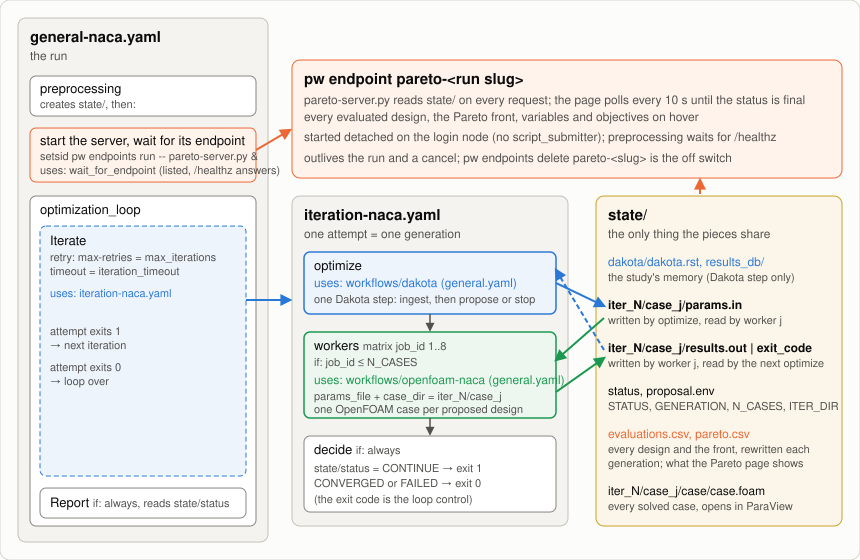

# Dakota-OpenFOAM Optimization

NACA airfoil shape optimization as a loop of two standalone workflows:

| Piece | Workflow | Called by |
|---|---|---|
| propose designs or stop | [`workflows/dakota`](../dakota/README.md) | the `optimize` job of `iteration-naca.yaml` |
| solve one design | [`workflows/openfoam-naca`](../openfoam-naca/README.md) | the `workers` matrix of `iteration-naca.yaml`, once per design |

Their READMEs describe the optimizer, the evaluator and their inputs; this one
covers only the loop, the live front and the tests. The loop mechanics come from
[`tutorials/optimization`](../../tutorials/optimization/README.md).

## How the pieces connect



```
general-naca.yaml
 ├─ preprocessing       state/ (the study) and the Pareto front server script
 ├─ session_runner      script_submitter: pw endpoints run pareto-<slug> -- pareto-server.py
 ├─ wait_for_endpoint   endpoint listed and /healthz answering → SKIP_CLEANUP → cancel the submitter
 └─ optimization_loop   needs the endpoint, then:
     ├─ Iterate         retried step; each attempt runs iteration-naca.yaml once:
     │                    optimize ──▶ workers-1..8 ──▶ decide
     │                    dakota step   openfoam-naca   exit 1 = next cycle, exit 0 = done
     └─ Report          if: always — verdict from state/status, the page URL
```

The two subworkflows only share files under `state/`:

1. `optimize` calls the Dakota step with the problem, the knobs and
   `state_dir`; the step ingests `iter_<N-1>/case_*/{results.out,exit_code}`
   and writes `iter_<N>/case_<j>/params.in` plus `proposal.env`, which the next
   step publishes as outputs.
2. `workers` slot *j* runs when `j <= N_CASES` and calls the OpenFOAM workflow
   with `case.params_file = ITER_DIR/case_j/params.in` and
   `case.case_dir = ITER_DIR/case_j`; the cluster, mesh, angle and environment
   settings pass straight through. The call leaves `results.out` or `exit_code`
   in that directory.
3. `decide` turns `state/status` into the exit code the parent's retry loops on.

Every case is therefore exactly a standalone `openfoam-naca` run: its own
checkout and environment check (lock-serialized install), its own submitter job,
and a `case/case.foam` that opens in ParaView, for every design of every
generation.

### Compared with the single-app version

The loop, batching, convergence and failure handling are unchanged. What moved:
`optimizer.py`, `driver.py` and `install-dakota.sh` to `workflows/dakota/app`
(problem-agnostic now), the OpenFOAM files to `workflows/openfoam-naca/app`,
`prepare-env.sh` and the Miniforge bootstrap to `tools/utils/`. The OpenFOAM
workflow writes the `case.sh` that records `exit_code`, where the driver used
to. Each worker is a three-job subworkflow instead of one submitter call,
roughly 10 s more per case on the login node. The installs are separate
prefixes (`openfoam-naca/miniforge`, `dakota/miniforge`). This directory has
no `app/`: preprocessing checks out `workflows/dakota/app` for the server only.

## The live Pareto front

`pareto-<run slug>` (in `pw endpoints list` and on the run page) is
`workflows/dakota/app/pareto-server.py` serving the study directory: every
evaluated design plotted as drag against negative lift, the front highlighted,
and `max_camber`, `camber_position`, `thickness`, generation, case and both
objectives on hover. It reads the files on every request and the page polls
every 10 s until the status is final, so a tab left open on a long run costs
one small request per refresh and nothing afterwards.

The server starts before the loop (`optimization_loop` needs
`wait_for_endpoint`), so the page is live from the first generation and a
server that cannot start fails the run before any case is spent. **The endpoint
outlives the run**: after the optimization finishes, or after a cancel, it keeps
showing the final front until you delete it. **Deleting the session cleans up
its processes**: `pw endpoints delete pareto-<run slug>` kills the server
(verified: no process left). A cancel *before* the endpoint is healthy tears
the server down through the submitter's cleanup; a cancel mid-generation kills
the running cases and SLURM jobs and leaves only the endpoint.

## Running it

Pick the resource, set `max_iterations`, `batch_size`, `stall_generations` and
`mesh_scale`, and choose login node or scheduled cases with `Cores per case`.
The **Design Problem** group holds the angle of attack, the variable bounds
(keep the three names) and the Dakota seed. The form's defaults are the demo:
login node, `mesh_scale` 1, 4 × 10, about 10 min. **Load saved inputs →
`mesh3_slurm_4ranks`** is the converged-mesh study: SLURM, 4 ranks per case,
`mesh_scale` 3, 8 × 10, 31 min on gcpsmall.

The run succeeds only when the optimizer wrote `CONVERGED`. The front is
`state/pareto.csv` and `state/pareto.svg` in the run's job directory, every
case under `state/iter_<N>/case_<j>/`, the history on the page and in
`state/evaluations.csv`. The retried `Iterate` step shows only its last
attempt; each worker's log is three jobs deep (`workers-<k>` → `preprocessing`,
`run_case`, `results`). `iteration_timeout` (default 2d) caps one generation
because the platform's default retry timeout is 30 s per attempt.

## Tests

`tests/general-naca/` (the variant is the YAML's basename): `gcpsmall.json`
(login node, 4 × 4), `gcpsmall-slurm-mpi2.json` (SLURM, 2 ranks) and
`gcpsmall-mesh3-slurm-4ranks.json` (the saved configuration). The runner
checks the endpoint and deletes it. Run with
`python3 tools/tests/run-workflow-test.py <test.json>`.
