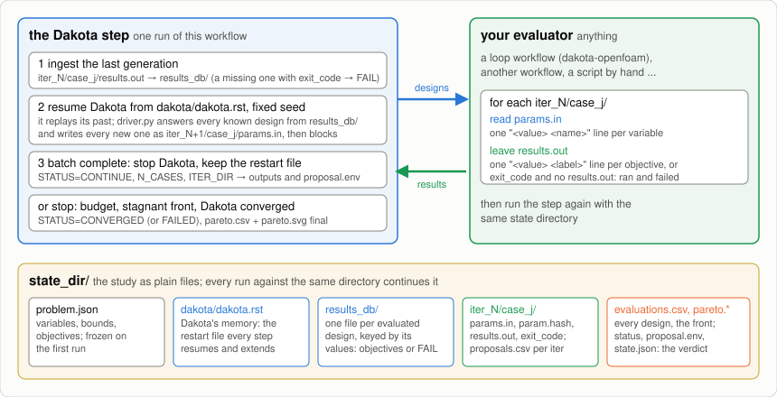

# Dakota Optimizer Step

One step of a [Dakota](https://dakota.sandia.gov) multi-objective optimization:
each run reads the results of the designs proposed last time, then either
proposes the next batch of designs (`CONTINUE`) or ends the study (`CONVERGED`,
`FAILED`). What evaluates the designs is up to you: a loop workflow such as
[`workflows/dakota-openfoam`](../dakota-openfoam/), another workflow, or a
script run by hand. Nothing in this workflow knows about OpenFOAM.



## How the optimization works

Dakota's MOGA (multi-objective genetic algorithm) keeps a population of designs
and evolves it generation by generation:

1. It proposes a generation: `batch_size` designs inside the variable bounds,
   at first random, later bred from the best designs so far (crossover and
   mutation).
2. Every design is evaluated: two objective values each, both to be minimized
   (negate a quantity to maximize it).
3. Designs that no other design beats on both objectives form the **Pareto
   front**, the set of best trade-offs. The next generation is bred from it.
4. The study stops when the front stops improving (its normalized hypervolume
   gains less than 0.001 over `stall_generations` generations), when Dakota's
   own criterion trips, or at `max_generations`.

Each run of this workflow is one turn of that cycle: step 1 for a new
generation, after steps 2–3 for the previous one. Expect fewer than
`batch_size` designs in some generations: offspring that duplicate a known
design are not proposed again.

## The state directory

The study lives in `optimizer.state_dir` on the resource, and every run against
the same directory continues it:

```
problem.json         variables, bounds and objectives, frozen on the first run
dakota/dakota.rst    Dakota's restart file: the study's memory
results_db/          one file per evaluated design (its objectives, or FAIL)
iter_<N>/case_<j>/   the proposed designs: params.in in, results.out out
iter_<N>/proposals.csv   the same designs as a table
evaluations.csv      every evaluated design with its objectives and status
pareto.csv, pareto.svg   the current front
state.json, status, proposal.env   generation counter and the last verdict
```

Leave `state_dir` empty to start a fresh study under the run's job directory
(`STATE_DIR` in the log); give that path to the next run to continue it. A
different problem needs a different directory: the restart file is only valid
for the study that wrote it, and the run fails if the variables or objectives
changed.

### Why a restart file, and what it costs

Dakota expects to call the evaluator itself and run to the end in one process;
it has no "propose a batch and exit" mode. This workflow pauses it instead:
every run resumes Dakota from the restart file with a fixed seed, so the method
replays its past deterministically; designs evaluated meanwhile are served
from `results_db/` by `driver.py`; and when Dakota asks for designs nobody has
evaluated yet, the drivers write them as `iter_<N>/case_<j>/params.in` and the
run stops Dakota and hands them out.

- **Advantages.** Any evaluator fits, including platform jobs that take hours
  on compute nodes, with no Dakota process alive in between. The study is plain
  files: it survives crashes, cancellations and restarts (a run that crashed is
  simply run again), it can be inspected and plotted at any time, and it can be
  continued later.
- **Disadvantages.** Each step replays the whole study before proposing, which
  grows with its length (seconds for hundreds of evaluations) and adds a fixed
  ~15 s wait to detect that a batch is complete. The method must be
  deterministic, so the seed is fixed and only Dakota methods that can be
  replayed from a restart file work this way; the input is generated for MOGA
  with two objectives and fixed settings. A design that failed is fed back as
  `FAIL` with penalty objectives rather than re-evaluated.

## Interface

**In** (form groups): `cluster.resource` (the resource holding the study; Dakota
runs on its login node, the step is seconds of work); `problem.variables`
(one `<name> <lower> <upper>` per line) and `problem.objectives` (two names, in
the order `results.out` lists them); `optimizer.state_dir`, `batch_size`,
`max_generations`, `stall_generations`, `seed`; `software.dakota_load`
(commands that put `dakota` on PATH; empty installs Dakota 6.16 from
conda-forge under `${service_parent_install_dir:-$HOME/pw/software}/dakota`).

**Out**: step outputs and `state_dir/proposal.env` carry `STATUS`,
`GENERATION`, `N_CASES`, `ITER_DIR`, `STATE_DIR`. The run succeeds on
`CONTINUE` and `CONVERGED` and fails on `FAILED`.

**The evaluator's contract**, per `ITER_DIR/case_<j>`: read `params.in` (one
`<value> <name>` line per variable; extra lines are ignored) and leave
`results.out` (one `<value> <label>` line per objective, written atomically), or
no `results.out` and an `exit_code` file when the evaluation ran and failed.
A case with neither file counts as never run: the same generation is handed
back once, twice in a row ends the study as `FAILED`. A generation whose cases
all failed continues, unless no design has ever succeeded or it is the third
such generation in a row.

## By hand

```bash
APP=/path/to/workflows/workflows/dakota/app
mkdir -p /tmp/toy && cd /tmp/toy
printf 'x1 0 1\nx2 0 1\n' > variables.txt
printf 'source ~/pw/software/dakota/miniforge/etc/profile.d/conda.sh\nconda activate dakota\n' > dakota-env.sh
for attempt in $(seq 1 30); do
  python3 $APP/optimizer.py --state-dir state --app-dir $APP \
      --variables-file variables.txt --objectives "f1 f2" \
      --batch-size 4 --max-generations 10 --stall-generations 3 --dakota-env $PWD/dakota-env.sh
  source state/proposal.env
  [ "$STATUS" != CONTINUE ] && break
  for c in $ITER_DIR/case_*; do (cd $c && python3 -c "
import math
v = dict((l.split()[1], float(l.split()[0])) for l in open('params.in') if l.strip())
f1 = v['x1']; g = 1 + 9 * v['x2']; f2 = g * (1 - math.sqrt(f1 / g))
open('results.out', 'w').write('%.10f f1\n%.10f f2\n' % (f1, f2))" && echo 0 > exit_code)
  done
done
cat state/status state/pareto.csv
```

From the platform, the same loop is one run per generation with the same
**State directory**; `tests/general/gcpsmall-toy-gen1.json` and
`gcpsmall-toy-gen2.json` do that (the runner's `setup` snippet evaluates the
proposals between them).

## Watching a study

`app/pareto-server.py --state-dir <dir> --port <p>` serves the directory as one
page (standard library only): every evaluated design on the two objectives,
the front highlighted, and each design's variables and objectives on hover,
refreshed every 10 s until the status is final.
[`dakota-openfoam`](../dakota-openfoam/) serves it as a `pw` endpoint.

## Files

`app/optimizer.py` (the step), `app/driver.py` (Dakota's analysis driver:
replay a known design or capture a new one), `app/install-dakota.sh`,
`app/pareto-server.py`. Shared: `tools/utils/miniforge.sh`,
`tools/utils/prepare-env.sh`.
