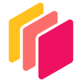

# Dask on SLURM

Starts a [Dask](https://www.dask.org) cluster with
[dask-jobqueue](https://jobqueue.dask.org) on a SLURM cluster: the scheduler and the
Dask dashboard run on the login node, served through a `pw` endpoint named
`dask-<run-slug>`, and the workers are SLURM jobs the cluster submits as work arrives
and cancels when it is done (`SLURMCluster.adapt`). The run submits demo workloads so
the dashboard shows the worker jobs join, compute and leave, then completes with the
cluster still running (or stopped, by choice). SLURM clusters only: the form says so
on any other resource and preprocessing fails before installing anything.



## How it works

1. **preprocessing** installs Miniforge with Dask, distributed and dask-jobqueue under
   the install directory (default `${HOME}/pw/software/.miniforge3-dask`), or takes the
   environment the form's load command provides, and writes `dask-env.sh`.
2. **session_runner** starts `app/dask_cluster.py` on the login node behind
   `pw endpoints run`: it creates the `SLURMCluster` from the worker job settings,
   checks the worker job script with `sbatch --test-only` (a bad partition, account or
   QoS fails the run in seconds), sets the adaptive range of jobs and writes
   `scheduler.json`.
3. **wait_for_endpoint** probes the dashboard until it answers and releases the submitter.
4. **workload** runs `app/dask_demo.py` through the scheduler file and logs the
   workers joining and the tasks remaining. With **Keep the cluster alive** off, it
   stops the cluster afterwards (a `STOP` file, which cancels the worker jobs) and no
   endpoint is left behind. A cancelled or failed run stops its cluster the same way.

## Form options

- **Dask Worker Jobs**: partition, cores and memory per job, worker processes per job,
  walltime, minimum and maximum jobs, extra `#SBATCH` lines, the network interface, and
  whether to request the memory from SLURM (`--mem`, off by default: the platform's cloud
  clusters have no memory accounting). `hsp` and `noaa` add account and QoS (`hsp` also
  node type) for on-prem resources.
- **Workload**: `all`, `array` (mean of a dense matrix product), `pi` (Monte Carlo with
  many small tasks), `dataframe` (groupby and correlation over a synthetic time series)
  or `none` (start the cluster and complete the run); its size (`small` runs in seconds
  on a few cores, `large` in minutes on 8), a timeout, and keep alive.
- **Installation**: the pinned environment, the latest from conda-forge, a pasted
  environment YAML, or a command that loads an existing Python with Dask.

## Connecting to the cluster

From any node of the cluster, with `<run>` the run's job directory
(`~/pw/jobs/<run-slug>/` for CLI runs):

```bash
source ~/pw/jobs/<run>/dask-env.sh
python -c "from dask.distributed import Client; print(Client(scheduler_file='$HOME/pw/jobs/<run>/scheduler.json'))"
```

The worker jobs appear in `squeue` as `dask-<run-slug>` while there is work; their
output is in `<run>/dask-worker-logs/` and the service's in `<run>/run.<id>.out`.
Stop the cluster with `pw endpoints delete dask-<run-slug>`.

## Variants and tests

`yamls/general.yaml` for cloud and on-prem SLURM clusters, `yamls/hsp.yaml`
(activate.hpc.mil) and `yamls/noaa.yaml` (noaa.parallel.works) with their submitters
and site fields; on a cloud cluster the three behave alike. `tests/<variant>/` run on
`pw://alvaro/gcpsmall` with `tools/tests/run-workflow-test.py`: the workloads with the
cluster kept alive or stopped, the cluster alone, and a partition that does not exist.
