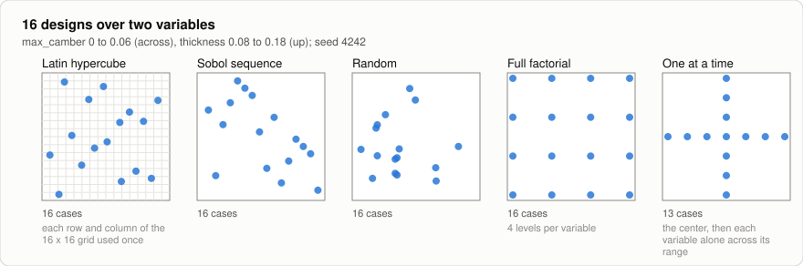
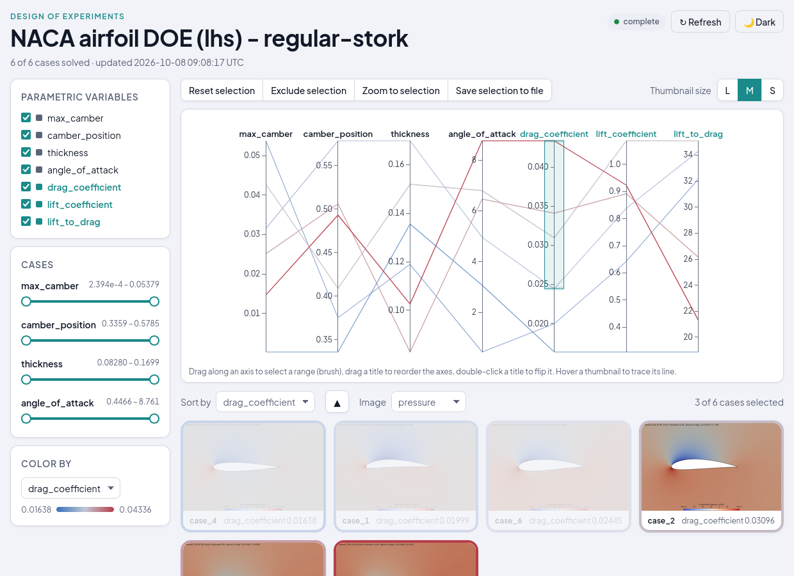

# DOE-OpenFOAM: Design of Experiments with Design Explorer

A design of experiments over the NACA 4-digit airfoil: a sampler spreads designs
over the variable bounds, or you paste your own, every design is solved in
parallel, and [Design Explorer](https://tt-acm.github.io/DesignExplorer/) shows
the inputs, the coefficients and the flow images of every design side by side.
Three standalone workflows do the work, called as subworkflows:

| Piece | Workflow | Called by |
|---|---|---|
| sample the designs | [`workflows/doe`](../doe/README.md) | the `preprocessing` job |
| solve one design | [`workflows/openfoam-naca`](../openfoam-naca/README.md) | the `workers` matrix, once per design |
| explore the results | [`workflows/design-explorer`](../design-explorer/README.md) | the `preprocessing` job, with images on |

Their READMEs describe the sampling methods, the case and the page; this one
covers the fan-out and the results. The matrix mechanics come from
[`tutorials/optimization`](../../tutorials/optimization/README.md).

## How the pieces connect


```
general.yaml
 ├─ preprocessing       checks the OpenFOAM and ParaView environments, then calls doe (the designs
 │                      into cases/) and, with images on, design-explorer (the page, once it answers)
 ├─ workers-1..n        matrix, if: job_id <= N_CASES — openfoam-naca on cases/case_<j>
 └─ results             if: always — every case into results.csv; fails only if none solved
```

The pieces share only the files under `cases/`: the sampler writes
`case_<j>/params.in`, each OpenFOAM call leaves `results.out` (or `exit_code` when
the solver failed) and `images/` next to it, and the collector and the page read
them. preprocessing reads the number of designs back from `cases/doe.env`.

## Sampling

**Sampling method**, **Number of cases**, **Random seed** and **Design
variables** go to [`workflows/doe`](../doe/README.md), whose README has the
methods and the rules for pasting your own cases. A pasted table runs up to 32
cases, the width of the workers matrix.

**The names connect the pieces.** Each line of **Design variables** names one of
openfoam-naca's case fields: `max_camber`, `camber_position`, `thickness` or
`angle_of_attack`. The sampler writes those names into every `params.in`, and
openfoam-naca reads them by name ([its design names](../openfoam-naca/README.md#design-names)).
A pasted table's header uses the same names.

- Leave a variable out of **Design variables**, and every case uses
  openfoam-naca's default for it, such as 5° for the angle.
- With **Your own cases (CSV)**, a variable that is in **Design variables** but
  has no column in the table gets the middle of its bounds in every case. With
  `thickness 0.08 0.18` and no `thickness` column, every case uses 0.13.
- A name misspelled in **Design variables** is ignored by the solver, and every
  case uses the default, with no warning. A table column that matches no
  variable stops the run instead.



## The Design Explorer page

With **Generate images** on (the default), every case renders its flow fields
with ParaView and [`workflows/design-explorer`](../design-explorer/README.md)
serves the study at the endpoint `design-explorer-<run slug>`, whose README
describes the page. It shows each case as soon as it solves.



The endpoint keeps serving after the run ends, until
`pw endpoints delete design-explorer-<run slug>`. With **Generate images** off
there are no images and no page; the results table is still written.

## Running it

Pick the resource, the sampling method, the number of cases and **Cases at a
time**, and choose login node or scheduled cases. The defaults run 8 Latin
hypercube designs at `mesh_scale` 2 on the login node, images on. **Load saved
inputs → `mesh3_slurm_4ranks`** runs 16 Sobol designs as SLURM jobs of 4 ranks
at the converged mesh, `mesh_scale` 3. On a login node, keep **Cases at a time**
× **Cores per case** within its cores.

The run succeeds when at least one case solved. A case whose solver diverged is
a `FAILED` row of the table, a result of the study, and the run lists it in a
warning.

## What a run leaves

In the run's job directory on the cluster:

```
cases/
├── doe.csv, doe.env      the sampled designs, and their count
├── case_1/ ... case_n/   one openfoam-naca case each:
│   ├── params.in           the design
│   ├── results.out         Cd and -Cl (or exit_code alone when the solver failed)
│   ├── case/case.foam      the solved case, for ParaView
│   └── images/             pressure, velocity, streamlines, turbulence, wake, mesh
├── results.csv           every case: status, inputs, Cd, Cl, Cl/Cd
└── data.csv              the solved cases, as the page reads them
```

## Files

This directory has no `app/`: the sampler, the page and the study reader belong
to [`workflows/doe`](../doe/README.md) and
[`workflows/design-explorer`](../design-explorer/README.md), which check out
their own. preprocessing checks out `workflows/openfoam-naca/app` and
`tools/utils` for the environment checks, and `workflows/design-explorer/app` for
the results job's `study.py`.
