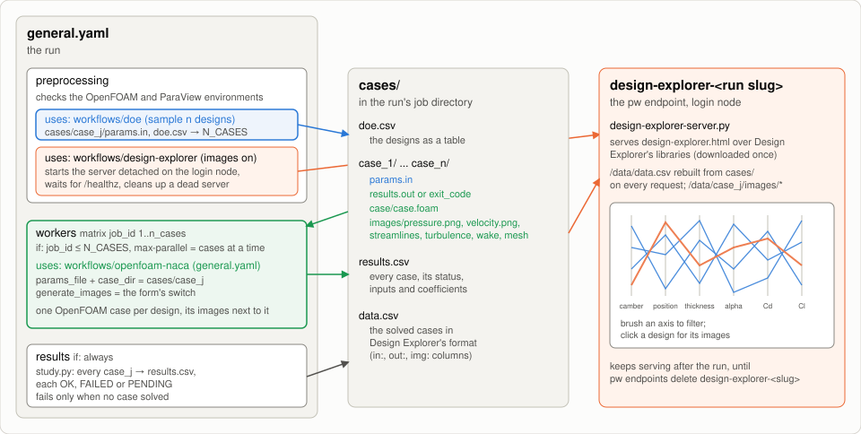

# DOE-OpenFOAM: Design of Experiments with Design Explorer

A design of experiments over the NACA 4-digit airfoil: a sampler spreads designs
over the variable bounds, or you paste your own, every design is solved by
[`workflows/openfoam-naca`](../openfoam-naca/README.md) in parallel, and
[Design Explorer](https://tt-acm.github.io/DesignExplorer/) shows the inputs, the
coefficients and the flow images of every design side by side.

| Piece | Where | Runs in |
|---|---|---|
| sample the designs | `app/doe.py` | the `preprocessing` job |
| solve one design | [`workflows/openfoam-naca`](../openfoam-naca/README.md) | the `workers` matrix, once per design |
| explore the results | `app/design-explorer.html` | the `design-explorer-<run slug>` endpoint |

The openfoam-naca README describes the case, its inputs and its images; this one
covers the sampling, the fan-out and the page. The matrix mechanics come from
[`tutorials/optimization`](../../tutorials/optimization/README.md).

## How the pieces connect



```
general.yaml
 ├─ preprocessing       checks the OpenFOAM and ParaView environments, samples the designs into
 │                      cases/, starts the Design Explorer server and waits until its endpoint answers
 ├─ stop_server_if_unhealthy   if: !completed — removes a server whose endpoint never answered
 ├─ workers-1..n        matrix, if: job_id <= N_CASES — openfoam-naca on cases/case_<j>
 └─ results             if: always — every case into results.csv; fails only if none solved
```

The jobs share only the files under `cases/`: the sampler writes
`case_<j>/params.in`, each OpenFOAM call leaves `results.out` (or `exit_code` when
the solver failed) and `images/` next to it, and the collector and the page read
them.

## Sampling methods

**Sampling method** spreads **Number of cases** designs over the bounds in
**Design variables**, one `<name> <lower> <upper>` per line. Equal bounds hold a
variable fixed.

| Method | How it spreads the designs | Cases |
|---|---|---|
| Latin hypercube (default) | each variable split into `n` intervals, each used once | `n` |
| Sobol sequence | quasi-random, even coverage in every dimension | `n` |
| Random | independent uniform samples (Monte Carlo) | `n` |
| Full factorial | a grid of `L` levels per variable, the largest `L` with `L^d <= n` | `L^d` |
| One at a time | the center, then each variable alone at `k = (n-1)/d` levels | `1 + d*k` |
| Your own cases (CSV) | the rows of a table you paste in **Cases (CSV)** | one per row, up to 32 |

`d` counts the variables that are not fixed. The two grid designs decide their
own size, and the spare matrix slots are skipped. **Random seed** makes the
first three repeatable.

### Your own cases

Paste one row per case under a header naming the variables:

```
max_camber,camber_position,thickness,angle_of_attack
0.00,0.40,0.12,4
0.02,0.40,0.12,4
0.04,0.40,0.12,4
```

- Commas, tabs (a paste from a spreadsheet), semicolons or spaces separate the
  values.
- A variable without a column is held at the middle of its bounds in **Design
  variables**. A value outside the bounds runs with a warning.
- Case, status and coefficient columns are skipped, so a previous run's
  `doe.csv`, `results.csv` or the page's `data.csv` pastes as it is. Any other
  unknown column stops the run, so a typo cannot fix a variable by accident.

## The Design Explorer page

With **Generate images** on (the default), every case renders its flow fields
with ParaView and the endpoint `design-explorer-<run slug>` serves the study:
[Design Explorer](https://github.com/tt-acm/DesignExplorer)'s parallel
coordinates in a page styled for the platform, light or dark.


- **Brush** an axis (drag along it) to select a range, and combine brushes
  across axes. Drag a title to reorder the axes, double-click it to flip one.
- The **Cases** sliders narrow the inputs, **Parametric variables** hides axes,
  and **Color by** colors the lines and the thumbnails.
- **Exclude selection** and **Zoom to selection** act on the brushed designs;
  **Save selection to file** downloads them as CSV.
- Thumbnails outside the selection fade. Hover one to trace its line, click it
  for the full image and the design's values. **Image** switches between
  pressure, velocity, streamlines, turbulence, wake and mesh.
- The page refreshes itself while cases are still running.

The endpoint keeps serving after the run ends, until
`pw endpoints delete design-explorer-<run slug>`. With **Generate images** off
there are no images and no page; the results table is still written.

## Running it

Pick the resource, the sampling method, the number of cases and **Cases at a
time**, and choose login node or scheduled cases. The defaults run 8 Latin
hypercube designs at `mesh_scale` 2 on the login node, images on. **Load saved
inputs → `mesh3_slurm_4ranks`** runs 16 Sobol designs as SLURM jobs of 4 ranks
at the converged mesh, `mesh_scale` 3. On a login node, keep **Cases at a time**
× **Cores per case** within its cores.

The run succeeds when at least one case solved. A case whose solver diverged is
a `FAILED` row of the table, a result of the study, and the run lists it in a
warning.

## What a run leaves

In the run's job directory on the cluster:

```
cases/
├── doe.csv               the sampled designs
├── case_1/ ... case_n/   one openfoam-naca case each:
│   ├── params.in           the design
│   ├── results.out         Cd and -Cl (or exit_code alone when the solver failed)
│   ├── case/case.foam      the solved case, for ParaView
│   └── images/             pressure, velocity, streamlines, turbulence, wake, mesh
├── results.csv           every case: status, inputs, Cd, Cl, Cl/Cd
└── data.csv              the solved cases, as the page reads them
```

## Variants

`yamls/hsp.yaml` (HSP, `activate.hpc.mil`) and `yamls/noaa.yaml` (NOAA,
`noaa.parallel.works`) run the same study with the platform's form and the
matching openfoam-naca variant: the resource as the top-level input, the SLURM
account and QoS, and on HSP the node type and the PBS account. The HSP form
saves a `nautilus_modules` configuration with Nautilus's OpenFOAM module. On
NOAA the installs go to the cluster's shared software tree when the account can
write there.

## Tests

| Test | Runs |
|---|---|
| `tests/general/gcpsmall.json` | 6 Latin hypercube designs on the login node, images and page |
| `tests/general/gcpsmall-slurm-mpi2.json` | 4 Sobol designs as SLURM jobs of 2 ranks |
| `tests/general/gcpsmall-no-images.json` | a full factorial over 3 variables (8 designs), images off |
| `tests/general/gcpsmall-csv.json` | 5 pasted cases (tab-separated, one variable left out) |
| `tests/hsp/gcpsmall-csv.json` | 3 cases pasted from a previous `doe.csv`, through the HSP form |
| `tests/hsp/gcpsmall.json` | 9 one-at-a-time designs through the HSP form |
| `tests/noaa/gcpsmall.json` | 4 random designs through the NOAA form |

Run one with `python3 tools/tests/run-workflow-test.py <test.json>`.

## Files

| `app/` | Role |
|---|---|
| `doe.py` | the sampler: bounds or a pasted table → `cases/case_<j>/params.in` and `doe.csv` |
| `study.py` | the collector: case directories (a DOE's or a Dakota study's) → `results.csv` and `data.csv` |
| `design-explorer.html` | the page |
| `design-explorer-server.py` | serves the page, its libraries, the images and the tables |
| `install-design-explorer.sh` | downloads Design Explorer once, at a pinned commit |

Also checked out: `workflows/openfoam-naca/app`, for the environment checks, and
`tools/utils`.
