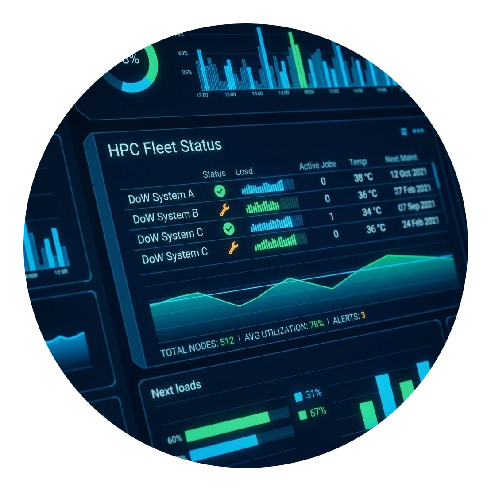

# HPC Status Monitor

A single pane of glass for your HPC fleet. At a glance: what's up, what's slow, where
your jobs will wait, and how much allocation you have left.



## What it's for

You have work to run on HPC systems, but the systems are scattered across sites,
schedulers and login nodes. Before submitting a job you want to know:

- Is the system even up right now?
- Which queue will get me running fastest?
- Am I close to burning through my allocation?
- Is `$SCRATCH` about to purge my files?

The Status Monitor answers those questions in one place, refreshed continuously, so you
don't have to `ssh` around and run five different commands to decide where to submit.

## What you'll see

- **Fleet status.** Every HPC system this deployment knows about, as cards grouped by
  site: what each machine is for, whether it is up, and how busy it is. "Knows about"
  merges three sources: the centre's status page, the live sessions the monitor holds to
  clusters, and the marketplace listings. Systems nothing is watching are marked as such
  and left out of the uptime figure.
- **Topology.** An interactive map of sites, systems and the live sessions between them,
  with hierarchy, radial, force, lane, load and geographic layouts, and a timeline that
  replays the last 6 hours to 3 days from the monitor's own records.
- **Queue health.** Live queue depth, node availability and core demand per system, with
  wait estimates derived from observed core turnover.
- **Quota usage.** Allocations in core-hours, burn rate, and warnings before the limit.
- **Storage.** Capacity and usage for `$HOME`, `$WORK` and `$SCRATCH`, with purge-window
  reminders.
- **Insights.** Recommendations ("this queue is draining", "you're at 92% of your
  allocation"), and **Where should I run this?**: describe a job and every queue that can
  run it is ranked.
- **API.** Everything on every page is JSON; the **API** tab lists every endpoint, runs it
  against the live deployment and hands you the `curl` command.
- **Alerts.** Point `alerts.webhook_url` at Slack, Teams or your own receiver to hear when a
  system goes down or comes back.

Every page has a **Help** button with the HPC terms it uses, and each metric a `ⓘ`
tooltip.

## How the workflow runs it

The jobs follow the repository's endpoint pattern:

1. **preprocessing** — on the dashboard host: checks out `workflows/hpc_status/app`,
   writes `inputs.sh`, runs `controller.sh` (the `pw` CLI check, the shared `uv` and the
   dashboard's virtualenv under `${HOME}/pw/software/hpc_status/venv`, idempotent: a venv
   that imports the server is reused) and assembles the start script.
2. **session_runner** — submits the start script through
   [`script_submitter/v3.6`](../script_submitter/), always on the host itself: the
   dashboard needs the `pw` CLI, its credentials and internet access for as long as it
   serves. `start-template.sh` wraps the server in `pw endpoints run`, which assigns the
   port and dials out, so the host needs no inbound access.
3. **wait_for_endpoint** — the shared [`wait_for_endpoint`](../wait_for_endpoint/)
   subworkflow waits for the endpoint, probes `/` with the run's key until the dashboard
   answers (up to 15 minutes: a first start has no cached fleet and answers only after one
   full sweep), touches the skip file so the dashboard outlives the run, and cancels the
   submitter.
4. **summary** — prints the dashboard URL and how to stop it.

The run completes within a minute or so; the dashboard keeps serving until its endpoint
is deleted.

### Where it runs, and on which credential

**Service host** defaults to the user workspace, which is the right choice unless you
have a reason to move it; pick a long-lived cluster to keep the dashboard serving when the
workspace recycles.

A run's own `PW_API_KEY` is revoked when the run completes, but the dashboard calls `pw`
for as long as it serves (`pw clusters ls`, `pw ssh` to every cluster). So the start
script hands it a credential that outlives the run, and says in the run log which one:

- **saved credentials** on the host (`pw auth` there), when they authenticate against
  this platform — they outlive everything;
- otherwise, on the user workspace, **the workspace key** from
  `/etc/profile.d/parallelworks-env.sh` (only that variable is taken from the file, and
  only when it works);
- otherwise a warning: the dashboard serves, but stops collecting when the run
  completes. Run `pw auth` on that host, or use the workspace.

The collector also recovers on its own if the key it holds dies mid-life
(`src/collectors/pw_cluster.py`).

### A stable address, and starting again

Without a subdomain the platform assigns a random one per session. The dashboard asks for
**`status-<username>`** instead (lowercased and hyphenated, so `Matthew.Shaxted` becomes
`status-matthew-shaxted`), or the **Public Subdomain** you set — the same URL every run.
That is a request, not a claim: `pw subdomains reserve status-<username>` keeps it yours.
When the platform refuses the subdomain the run falls back to an assigned address and
says so.

**Starting again restarts.** Before launching, the start script deletes any endpoint at
that address whose name is this dashboard's (`hpc-status`, `hpc-status-<run>` — or
`rdhpcs-status…` on NOAA), wherever it runs: its `pw endpoints run` notices the session is
gone and takes its process tree down. That also clears a session a recycled workspace
left listed but dead. Any other endpoint at the address stops the run with an error
rather than being deleted.

The endpoint itself is named `hpc-status-<run-slug>` like every endpoint here.

## Inputs

| Input | Default | Meaning |
|---|---|---|
| Service host | user workspace | Where the dashboard runs (see above) |
| Platform | `auto` | `general.yaml` only: `generic`, `hpcmp` or `noaa` configuration; `auto` picks it from the platform host (`*.hpc.mil` → HPCMP, NOAA hosts → NOAA) |
| Public Subdomain | *(blank)* | Hostname label; blank derives `status-<username>` |
| UI Theme | `light` | Default color theme |
| Enable Cluster Pages | on | Queue and quota pages |
| Enable Cluster Monitor | on | Background cluster collection |
| Refresh Interval | `120` (`180` on NOAA) | Seconds between collections (at least 60) |
| Clusters Swept At Once | `6` | Clusters collected from simultaneously |

The settings live in the collapsed **HPC Status Settings** group, so a launch with the
defaults is one click. Everything else is in the deployment's YAML config
(`app/configs/`); see [docs/configuration.md](docs/configuration.md).

## Variants

| YAML | Platform | Configuration | Endpoint prefix |
|---|---|---|---|
| `yamls/general.yaml` | anything but the two below | `auto` (dropdown) | `hpc-status` |
| `yamls/hsp.yaml` | `activate.hpc.mil` | `configs/config.hpcmp.yaml` — HPCMP fleet from centers.hpc.mil, DSRC names, purple branding | `hpc-status` |
| `yamls/noaa.yaml` | `noaa.parallel.works` | `configs/config.noaa.yaml` — RDHPCS systems, pins every `pw` call to the `noaa` identity | `rdhpcs-status` |

Each passes its platform's script submitter. `noaa.yaml` also picks the install directory
at run time, as the other NOAA variants here do: the cluster's shared software tree
(`/contrib/pw` on Hera, Mercury and Ursa, `/usw/rdhpcs/software/pw` on Gaea) when the
account can write there, `${HOME}/pw/software` otherwise (the workspace included).

## Running from the CLI

```bash
pw workflows run "$PWD/workflows/hpc_status/yamls/general.yaml" -i '{"cluster":{"resource":"workspace"}}'
pw endpoints list                              # hpc-status-<run-slug> and its URL
pw endpoints delete hpc-status-<run-slug>      # stops the dashboard
```

## Stopping it

Delete its session from the Sessions page, or `pw endpoints delete hpc-status-<run-slug>`.
`pw endpoints run` shuts down when its session goes (`Endpoint "..." was deleted; shutting
down.`), taking the dashboard and its collectors with it. Launching again replaces it.

## Debugging

Everything is in the run's job directory on the dashboard host
(`~/pw/jobs/<run-slug>/` for CLI runs, `~/pw/jobs/<workflow-name>/<run-number>/` for
registered ones): `subworkflows/session_runner/step_0/run.<id>.out` is the endpoint
wrapper's and the dashboard's output (which configuration and credential it chose, every
sweep), `subworkflows/session_runner/step_0/launch-dashboard.sh` the exact server command.
The dashboard keeps its cache, history database and briefings in `~/.hpc_status/` on that
host, so history survives relaunches. From anywhere:

```bash
pw workflows runs logs <slug> --job session_runner
pw workflows runs logs <slug> --job wait_for_endpoint
pw workflows runs errors <slug>
```

## Developing the dashboard

The server is standard-library HTTP plus `requests`, `beautifulsoup4`, `pyyaml`
(`app/requirements.txt`); the pages are plain HTML/JS with no build step.

```bash
cd workflows/hpc_status
python3 -m venv ~/.venvs/hpc-status && ~/.venvs/hpc-status/bin/pip install -r app/requirements.txt pytest
(cd dev && ~/.venvs/hpc-status/bin/python -m pytest)     # the unit and integration suite
(cd app && ~/.venvs/hpc-status/bin/python -m src.server.main --port 8080 --config configs/config.yaml)
```

With the `pw` CLI authenticated the local server collects from every cluster you have
access to. After changing the API catalog (`app/src/server/api_catalog.py`), regenerate
the spec with `python dev/scripts/build_openapi.py` (a test fails while it is stale);
`dev/scripts/build_basemap.py` rebuilds the topology map outline
(`app/web/assets/data/README.md`).

## Files

```
workflows/hpc_status/
├── yamls/{general,hsp,noaa}.yaml
├── app/                     # The only subtree a run checks out
│   ├── controller.sh        # pw check, uv, the dashboard's virtualenv
│   ├── start-template.sh    # configuration, durable credential, address, pw endpoints run
│   ├── requirements.txt
│   ├── configs/             # config.yaml (generic), config.hpcmp.yaml, config.noaa.yaml
│   ├── src/                 # collectors, data layer, insights, HTTP server
│   └── web/                 # pages, assets, bundled basemap
├── docs/                    # API, configuration, glossary, NOAA marketplace copy, examples
├── dev/                     # pytest.ini, tests/, scripts/ (OpenAPI, basemap), schemas/
├── tests/<variant>/         # End-to-end tests (tools/tests/README.md)
└── thumbnails/              # hpc-status.png, hpcmp-status.png, rdhpcs-status.png
```

## Provenance

Moved from the standalone `parallelworks/hpc_status` repository (`main` @ `30ce200`). Its
`src/`, `web/` and `configs/` are `app/` verbatim but for one log line; `scripts/run.sh`
became `controller.sh` (install) and the launcher `start-template.sh` writes, and
`scripts/serve-endpoint.sh` the rest of `start-template.sh`; the single-job
`workflow.yaml`, `yamls/hsp.yaml` and `yamls/rdhpcs.yaml` became the three variants here.
What changed and why: `MIGRATION.md`.
