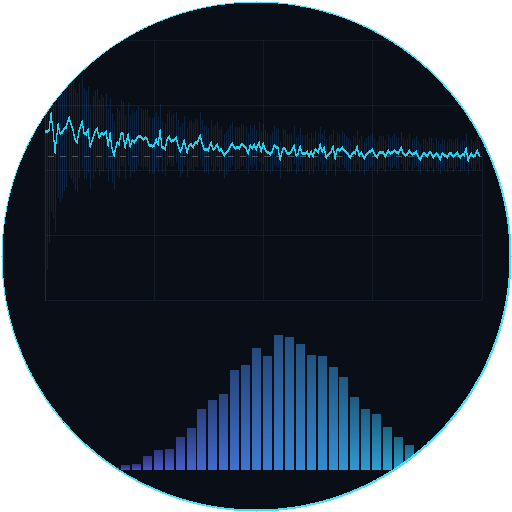

# Multi-Site Monte Carlo Option Pricing

A demo workflow that prices exotic options with Monte Carlo simulation across one or
more compute sites, with a live dashboard showing the price converging, the payoff
histogram and each site's throughput in real time. It shows ACTIVATE bursting one
computation to several resources at once and merging the results in one place.



## Why Monte Carlo for Options Pricing?

An option is a financial contract that gives the holder the right — but not the
obligation — to buy or sell an asset at a set price before a certain date. Pricing an
option means figuring out what that right is worth today, which requires reasoning
about every possible future path the underlying asset's price could take.

For the simplest options (e.g., standard European calls and puts), the Black-Scholes
formula provides an exact answer. But most options traded in practice are more
complex — their payoff may depend on the average price over time, whether the price
ever crosses a barrier, or the behavior of multiple correlated assets. These "exotic"
options have no closed-form solution.

**Monte Carlo simulation** solves this by brute force: simulate thousands or millions
of possible price paths, compute the payoff for each one, and average the results to
get a fair price. It is the industry-standard method for pricing complex derivatives
because it handles what closed-form models cannot:

- **Path-dependent options** — Asian options depend on the *average* price over the
  life of the contract, not just the terminal price. There is no closed-form solution
  under standard geometric Brownian motion, so simulation is the practical method for
  pricing them.
- **Barrier options** — Knock-out and knock-in options depend on whether the price
  *ever* crosses a threshold during the contract. Pricing these requires simulating
  the full path, not just the endpoint.
- **Flexible modeling** — Monte Carlo naturally accommodates stochastic volatility,
  jump diffusion, multiple correlated underlyings, and other features that break
  analytical tractability. Adding complexity to the model means changing the path
  generator, not deriving a new formula.
- **Risk measurement** — Simulation produces a full distribution of outcomes (as shown
  in the dashboard's payoff histogram), not just a single price. This enables direct
  computation of Value-at-Risk, expected shortfall, and other tail-risk metrics that
  regulators and risk managers require.

The tradeoff is compute: Monte Carlo convergence scales as O(1/√N), meaning 100× more
paths are needed for 10× more precision. This makes it a natural fit for parallel and
distributed computing — exactly what this workflow demonstrates by splitting paths
across multiple sites.

## What It Does

1. **Serves a dashboard** (FastAPI + WebSocket) on the login node of the dashboard
   host, through a **`pw` endpoint** named `monte-carlo-<run-slug>`
2. **Splits the batches** of paths evenly across the compute sites in the form
3. **Simulates** geometric Brownian motion paths on every site in parallel, on its
   login node or on compute nodes allocated with `srun`, and POSTs each batch's
   statistics (mean, variance, payoff histogram) to the dashboard as it finishes
4. **Merges** the batches as they arrive (Chan's parallel mean/variance update), so the
   price estimate and its confidence interval tighten live
5. **Completes the run** once every site is done, printing the price, its standard
   error and — for European options — the Black-Scholes reference; the dashboard keeps
   serving the result until its endpoint is deleted

## Architecture

```
              ACTIVATE Workflow
                    │
         ┌──────────┴──────────┐
         ▼                      ▼
  Site 1 (this host)      Site 2 (remote)
  batches 0..N/2          batches N/2..N
    localhost:PORT         reverse SSH tunnel
         │                      │
         └── POST batches ──────┘
                    │
              Dashboard Server  ──  pw endpoints run  ──▶  https://<subdomain>.activate.pw/
              (dashboard host)
```

The jobs follow the repository's endpoint pattern:

1. **preprocessing** — on the dashboard host: checks out `workflows/monte-carlo-pricing/app`,
   writes `inputs.sh`, runs `controller.sh` (Python check, `uv`, and the virtualenv under
   `${HOME}/pw/software/monte-carlo-pricing/venv` with FastAPI and numpy, idempotent) and
   assembles the start script.
2. **session_runner** — submits the start script through
   [`script_submitter/v3.6`](../script_submitter/) on the login node (never scheduled:
   the sites' tunnels terminate on the host that dispatches them). `start-template.sh`
   wraps the dashboard in `pw endpoints run`; the assigned port arrives as `PORT` and a
   small launcher publishes it as `SESSION_PORT` in the run directory.
3. **wait_for_endpoint** — the shared [`wait_for_endpoint`](../wait_for_endpoint/)
   subworkflow waits for the endpoint, probes its URL with the run's key, touches the
   skip file so the dashboard outlives the run, and cancels the submitter.
4. **simulate** — sends the option and the batch plan to the dashboard
   (`POST /api/config`), runs `dispatch_simulations.sh`, and checks in the summary that
   the dashboard received every planned batch.

## Sites and how they are reached

`dispatch_simulations.sh` runs on the dashboard host and handles each site in parallel:

- **A site on the dashboard host's own resource** simulates right there:
  `run_simulation.sh` on the login node, or on compute nodes through `srun`, which reach
  the dashboard on the login node's hostname. The simulator runs with the dashboard's
  virtualenv (it carries numpy). No tunnel and no SSH key are involved, so a cloud
  cluster's login node is a valid dashboard host for itself.
- **A site on another resource** is reached with `ssh` over `pw ssh --proxy-command`
  carrying a reverse tunnel back to the dashboard port. The simulation scripts are
  copied to `~/pw/jobs/monte_carlo_remote/<run-slug>/app/` over that same SSH path and
  run there; `setup_site.sh` uses the site's `python3` when it has numpy and otherwise
  builds a numpy virtualenv once at `~/pw/software/monte-carlo-pricing/site-venv` (with
  no way to install numpy, the simulator falls back to pure Python, about 20× slower). With
  **Schedule Job?** on, a TCP proxy on the site's login node exposes the tunnel to the
  compute nodes and the batches run under `srun`. The site needs no GitHub access and
  always runs the code the dashboard host checked out. This does need the platform SSH
  key (`~/.ssh/pwcli`) on the dashboard host, which the user workspace and on-prem
  resources have.

Only SLURM sites can schedule; every other site simulates on its login node. The
**Additional Directives** editor takes `#SBATCH` lines, which are passed to `srun` as
options (so `#SBATCH --account=...` or `--exclusive` work; commented `##SBATCH` lines
and trailing comments are dropped). Multi-node allocations split the site's batch range
across the tasks by `SLURM_PROCID`. **Worker Threads: Auto** counts the CPUs SLURM gives
each task, which is one unless the directives ask for more: add
`#SBATCH --cpus-per-task=<N>` to run N simulation processes per node (`--exclusive`
alone does not raise it).

## Inputs

| Input | Description | Default |
|-------|-------------|---------|
| Dashboard Host | Login node, cloud VM or the user workspace that serves the dashboard and dispatches the sites | — |
| Compute Sites | One entry per site: resource, **Schedule Job?** (SLURM only) and its partition, node count, walltime and extra directives | — |
| Option Type | Asian call/put (arithmetic average), European call/put (with the Black-Scholes benchmark), barrier up-and-out call | Asian Call |
| Spot Price (S0) | Current underlying asset price | 100 |
| Strike Price (K) | Option strike price | 100 |
| Volatility (sigma) | Annualized volatility | 0.2 |
| Risk-Free Rate (r) | Annualized risk-free rate | 0.05 |
| Time to Expiry (T) | Years until expiration | 1.0 |
| Barrier Level | Knock-out level (barrier options only) | 150 |
| Monitoring Points | Time steps per path (252 = daily for a year) | 252 |
| Total Simulations | Paths across all sites: 100K to 10M | 500K |
| Batch Size | Paths per batch (smaller = more frequent dashboard updates) | 10K |
| Worker Threads | Simulation processes per node: auto (all cores, at most 16) or 1, 4, 8 | Auto |

## Running from the CLI

```bash
pw workflows run "$PWD/workflows/monte-carlo-pricing/yamls/general.yaml" -i '{
  "head": {"resource": "pw://<user>/<cluster>"},
  "targets": [{"resource": "pw://<user>/<cluster>", "scheduler": true,
               "slurm": {"partition": "compute", "nodes": "1", "time": "00:10:00"}}],
  "simulation_settings": {"option_type": "asian_call", "total_simulations": "500000",
                          "batch_size": "10000", "parallelism": "auto"}
}'
pw endpoints list                             # monte-carlo-<run-slug> and its URL
pw endpoints delete monte-carlo-<run-slug>    # stops the dashboard
```

Open the endpoint (Sessions page, or the URL the `simulate` job prints) to watch the
price converge; opening it after the run shows the final state.

## Dashboard Features

- **Price convergence chart** — running Monte Carlo estimate with a narrowing 95%
  confidence interval (and the Black-Scholes price for European options)
- **Payoff histogram** — distribution of discounted payoffs across all simulated paths
- **Per-site throughput** — batch completion rate by site, color-coded
- **Live statistics** — elapsed time, paths/sec, current price estimate, standard error
- **Late-join support** — opening the dashboard mid-run shows all completed batches

## Files

```
workflows/monte-carlo-pricing/
├── yamls/
│   └── general.yaml             # Cloud and on-prem SLURM clusters, the user workspace
├── app/                         # The only subtree a run checks out
│   ├── controller.sh            # Dashboard host: Python, uv, virtualenv (FastAPI + numpy)
│   ├── start-template.sh        # Dashboard behind pw endpoints run; publishes SESSION_PORT
│   ├── dispatch_simulations.sh  # Splits the batches and drives every site (local or over SSH)
│   ├── run_simulation.sh        # Simulates a batch range and POSTs each batch
│   ├── setup_site.sh            # Remote site: picks or builds a python with numpy
│   ├── simulator.py             # GBM paths and payoffs (numpy, pure Python fallback)
│   ├── dashboard.py             # FastAPI + WebSocket live dashboard
│   └── templates/index.html     # Dashboard UI
├── tests/general/               # End-to-end tests (tools/tests/README.md)
├── thumbnails/monte-carlo-pricing.png
├── generate_thumbnail.py        # Regenerates the thumbnail (standard library only)
└── README.md
```

## Requirements

- **Python 3** on every site; numpy is used when present or installable (the simulator
  has a pure Python fallback)
- **Python 3.9+** on the dashboard host for the dashboard, or internet access for `uv`
  to install a newer interpreter; `uv` and the virtualenv are installed once under
  `${HOME}/pw/software`
- `~/.ssh/pwcli` on the dashboard host to dispatch to *other* resources
- No GPU required — pure CPU simulation

## Debugging

Everything is in the run's job directory on the dashboard host
(`~/pw/jobs/<run-slug>/` for CLI runs, `~/pw/jobs/<workflow-name>/<run-number>/` for
registered ones): `SESSION_PORT` is the dashboard's local port,
`subworkflows/session_runner/step_0/run.<id>.out` the endpoint wrapper's and the
dashboard's output, `logs/simulate/step_1/step.out` the dispatcher's log with every
site's output prefixed by `[site-N]`, and `pricing-state.json` the dashboard state the
summary read. Remote sites keep the copied scripts and nothing else under
`~/pw/jobs/monte_carlo_remote/<run-slug>/`. From anywhere:

```bash
pw workflows runs logs <slug> --job simulate
pw workflows runs logs <slug> --job session_runner
pw workflows runs errors <slug>
```

## Provenance

Moved from the standalone `parallelworks/monte-carlo-pricing` repository (`main` @
`47d2df6`), which shared its skeleton with `burst-render-demo` and is migrated the same
way. Its `scripts/` became `app/`; the install half of `start_dashboard.sh` became
`controller.sh`, the launch half `start-template.sh`; `setup.sh` became
`setup_site.sh` on remote sites; the `sessions:` block and the `update_session` /
`wait_for_dashboard` jobs became the `script_submitter` + `wait_for_endpoint` jobs.
Details and test results: `MIGRATION.md`.
