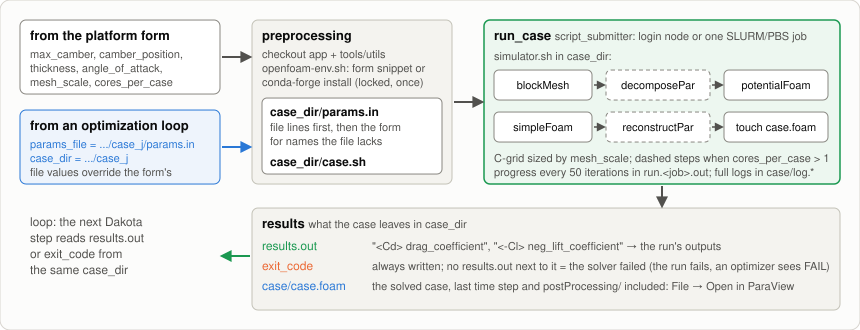
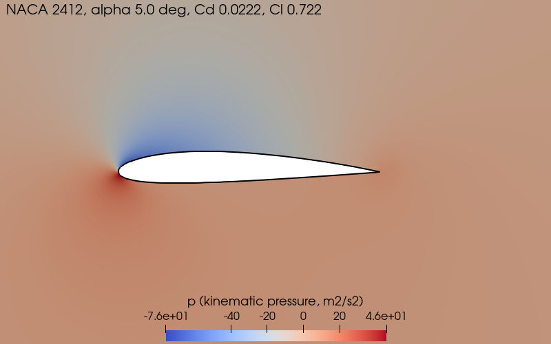
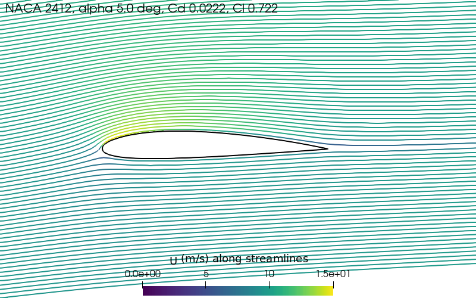

# OpenFOAM NACA Airfoil Case

One OpenFOAM case of a NACA 4-digit airfoil: the workflow meshes the shape you
give it (camber, camber position, thickness) with a structured C-grid, solves the
turbulent flow at the chosen angle of attack (`potentialFoam` + `simpleFoam`,
Spalart-Allmaras, Re = 10⁶), reports the lift and drag coefficients, and leaves
the case ready to open in ParaView. Ask for images and it also renders the
fields with ParaView, on the cluster, without a display.

It runs on its own from the platform, and it is the evaluator of
[`workflows/dakota-openfoam`](../dakota-openfoam/), which calls this same YAML
once per design the optimizer proposes, and of
[`workflows/doe-openfoam`](../doe-openfoam/), which calls it once per sampled
design and shows the images in Design Explorer.



## Inputs

| Group | Input | Meaning |
|---|---|---|
| `cluster` | `resource`, `scheduler`, `cores_per_case`, `slurm`, `pbs` | where the case runs: the login node, or one SLURM/PBS job of `cores_per_case` MPI ranks (`--nodes=1 --ntasks=N`, PBS `select=1:ncpus=N:mpiprocs=N`) |
| `case` | `max_camber` [0, 0.06], `camber_position` [0.3, 0.6], `thickness` [0.08, 0.18] | the NACA digits as chord fractions (0012, 2412, 4412, …); the box where the mesh generator was validated |
| | `angle_of_attack` | incidence in degrees (default 5) |
| | `mesh_scale` 1–6 | multiplies every cell count; cost grows roughly with the cube (table below) |
| | `case_dir` | where to build and solve; empty = `case/` under the run's job directory |
| | `params_file` | a Dakota-style params file (`<value> <name>` per line): **its values override the form fields of the same name**, fields it does not list keep the form's values ([Design names](#design-names)) |
| `postprocessing` | `generate_images` | off by default; on, the solved case is rendered to PNG images with ParaView ([below](#images-of-the-results)) |
| `software` | `openfoam_load` | commands that put OpenFOAM on PATH (`module load openfoam/2412`, `source .../etc/bashrc`); empty installs v2412 from conda-forge under `${service_parent_install_dir:-$HOME/pw/software}/openfoam-naca` (~5 min once) |
| | `paraview_load` | shown with images on: commands that put `pvpython` on PATH (`module load paraview/5.13`); empty downloads the official ParaView 6.1.1 binaries under `.../openfoam-naca/paraview` (x86_64, ~830 MB once, 2.7 GB on disk) |

## Design names

The case reads its design by name. `app/design-parameters.txt` lists the four
names. They are also the `case` fields of the form and the lines of a
`params.in`:

| Name | Form field | Default | Meaning |
|---|---|---|---|
| `max_camber` | Maximum camber | 0.02 | first NACA digit / 100 |
| `camber_position` | Camber position | 0.4 | second NACA digit / 10 |
| `thickness` | Thickness | 0.12 | last two NACA digits / 100 |
| `angle_of_attack` | Angle of attack | 5 | degrees |

The other `case` fields, `mesh_scale`, `case_dir` and `params_file`, are run
settings, not design names. They come from the form only: a params file with a
`mesh_scale` line fails the case, like any other name not in the list.

The **Create the Case** step writes the case's `params.in`. With **Design from a
params file**, it builds it from the file and the form:

- A name the file lists overrides the form field of that name.
- A name the file leaves out keeps the form's value.
- Any other name, or a value that is not a number, fails the case before
  anything runs. The error lists the four names, so a misspelled `max_cambr`
  stops the run instead of solving at the default camber.

So a workflow that calls this one only has to write these names into
`params.in`. For example, doe-openfoam and dakota-openfoam write the names of
their **Design variables**.

## What a run leaves

In the case directory (`CASE_DIR` in the log):

```
params.in        the design the case was solved with (file values merged over the form's)
results.out      "<Cd> drag_coefficient" and "<-Cl> neg_lift_coefficient"
exit_code        the simulator's exit status, written even when it failed
run.<job>.out    the streamed log: every OpenFOAM step, one solver progress line per 50 iterations
case/            the OpenFOAM case, final time step included; case/case.foam opens it in ParaView
images/          with images on: pressure, velocity, streamlines, turbulence, wake, mesh (PNG),
                 manifest.json and render.log (the full pvpython output)
```

The `results` job publishes `DRAG_COEFFICIENT`, `LIFT_COEFFICIENT`,
`PARAVIEW_FILE` and, with images on, `IMAGES_DIR` as outputs and fails the run
when there is no `results.out` (a diverged solver), printing the log tails.
Reference: NACA 2412 at 5°, `mesh_scale` 1 gives Cd ≈ 0.0222, Cl ≈ 0.722.

### Images of the results

With **Generate images** on, the case ends by rendering its fields to
`images/` with ParaView's `pvpython` (`app/render-images.sh` runs
`app/render-case.py` on `case/case.foam`), on the node that solved it. Six
plan views of the last time step, each labeled with the design and its
coefficients:





| Image | Shows |
|---|---|
| `pressure.png` | kinematic pressure `p` around the airfoil (diverging map, range from the near field) |
| `velocity.png` | velocity magnitude around the airfoil |
| `streamlines.png` | streamlines seeded upstream, colored by velocity magnitude |
| `turbulence.png` | the Spalart-Allmaras eddy viscosity `nut` on a log scale: the boundary layer and the wake |
| `wake.png` | velocity magnitude over the wake, four chords downstream |
| `mesh.png` | the C-grid cells around the airfoil |

Where ParaView comes from: the **ParaView environment commands** of the form
(a site module; any build from 5.10 on), or, left empty, the official 6.1.1
Linux binaries that `app/install-paraview.sh` downloads once per cluster
without root. Those render without a display or any system GL library (the
single Linux build of ParaView 6 falls back to its bundled OSMesa; the
separate 5.13 "osmesa" build needed a system `libglapi.so.0` that minimal
cloud images lack). The renderer names the OSMesa window outright
(`VTK_DEFAULT_OPENGL_WINDOW=vtkOSOpenGLRenderWindow`: VTK's own choice tried
EGL on a node with NVIDIA libraries and no GPU and crashed), falls back to the
build's default backend, then to `xvfb-run` for a build that needs an X
server, and leaves `pvpython` without the interpreter's teardown once the
images are written (its exit hung in the software renderer's threads once);
a render is complete when `manifest.json` exists, whatever the exit status,
and `RENDER_TIMEOUT` (default 900 s) bounds it. The installer renders a test
image the first time, so a node where offscreen rendering cannot work fails
in preprocessing, not in every case. A case whose images fail to render is
still a solved case: the coefficients are on disk first, and the `results`
job prints the renderer's log as a warning. Six images take about 5 s.

### Opening the case in ParaView

ParaView reads OpenFOAM cases through any `*.foam` file in the case directory.

1. Copy `case/` to the machine running ParaView, for example

   ```bash
   scp -r -i ~/.ssh/pwcli -o ProxyCommand="pw ssh --proxy-command %h" \
       <user>@<resource>:~/pw/jobs/<run-slug>/case/case ./naca-case
   ```

   (`pw ssh configure <resource>` writes an SSH config entry instead; the
   `processor*` directories of a decomposed case can stay behind, the workflow
   reconstructs the last time step).
2. **File → Open** `case.foam`, **Apply**, pick the last time step: `p`, `U`,
   `nut`, `nuTilda`. The case is one cell deep in *z*; look at it from +z.

`case/postProcessing/forceCoeffs1/<time>/coefficient.dat` has Cd and Cl per
iteration.

## Cost, accuracy and parallel runs

Measured on gcpsmall for the reference design, one core:

| `mesh_scale` | cells | time | Cd | Cl |
|---:|---:|---:|---:|---:|
| 1 | 5.4k | ~10 s | 0.0222 | 0.722 |
| 2 | 21.6k | ~1 min | 0.0193 | 0.718 |
| 3 | 48.6k | ~3.5 min | 0.0190 | 0.707 |
| 4 | 86.4k | ~10 min | 0.0194 | 0.698 |
| 6 | 194k | ~35 min | 0.0206 | 0.684 |

The mesh is essentially converged by scale 3–4; scale 1 is the demo setting
(~10% high on drag, nearly thickness-blind). The remaining gap to wind-tunnel
data (Cl ≈ 0.74, Cd ≈ 0.010) is the fully turbulent model, not the mesh, so
treat the coefficients comparatively.

`cores_per_case` > 1 decomposes the mesh into N chordwise strips
(`hierarchical`, deterministic; the conda-forge scotch partitions differently
on every call and tips marginal designs into divergence) and runs the solvers
under `mpirun --bind-to none -np N`. It pays from `mesh_scale` 3–4 (4 ranks:
~1.5 min instead of ~3.5 min at scale 3); at scale 1 it is slower than serial.
The sourced environment may `export MPIRUN="srun --mpi=pmix"` to replace the
launcher.

The simulator caps the ranks at one per 1,000 cells (`MIN_CELLS_PER_RANK`, 0
disables the cap) and says so in the case log: 16 ranks on the 5,400-cell base
mesh is 337 cells per rank, and on Nautilus a 5% camber design diverged that way
in under 100 iterations while converging serially, on 4 ranks (1,350 cells per
rank) and on 16 ranks at `mesh_scale` 3, with the Intel and Gcc builds alike
(2026-10-05). So 16 ranks need `mesh_scale` 2 or more to be used in full. A
user-set `MPIRUN` carries its own rank count and is only warned about.

## As a subworkflow

```yaml
- uses: github/parallelworks/workflows@canary
  with:
    $yaml: workflows/openfoam-naca/yamls/general.yaml
    cluster: { resource: ..., scheduler: ..., cores_per_case: ..., slurm: {...}, pbs: {...} }
    case:
      params_file: <iter dir>/case_<j>/params.in    # the proposed design
      case_dir: <iter dir>/case_<j>                  # solve it there
      angle_of_attack: 5
      mesh_scale: 1
    postprocessing: { generate_images: true }       # images/ next to results.out
    software: { openfoam_load: ..., paraview_load: ... }
```

The call leaves `results.out` in `case_dir`, or `exit_code` without it when the
solver failed, which is what an optimizer step reads next, and `images/` when
asked (what `doe-openfoam` shows in Design Explorer). Each call checks out
this app and prepares its environment itself; the installer takes a lock, so
concurrent calls on a cold cluster install once. Worked example:
[`dakota-openfoam/yamls/iteration-naca.yaml`](../dakota-openfoam/yamls/iteration-naca.yaml).

## Files

| `app/` | Role |
|---|---|
| `design-parameters.txt` | the four design names this runner reads from `params.in`; Create the Case checks a params file against it |
| `install-openfoam.sh` | idempotent conda-forge install, the `lib/sys-mpich` link that makes `-parallel` runs load the MPI Pstream, the activation file for `tools/utils/prepare-env.sh` |
| `naca_blockmesh.py` | NACA 4-digit parameters → structured C-grid `blockMeshDict` |
| `openfoam-case/` | the case template: boundary conditions, schemes, solver settings |
| `simulator.sh` | `params.in` → case → `blockMesh` (+ `decomposePar`) → `potentialFoam` → `simpleFoam` → `results.out` → `reconstructPar` + `case.foam`; env contract `MESH_SCALE`, `CORES_PER_CASE`, `MIN_CELLS_PER_RANK`, `OPENFOAM_ENV`, `MPIRUN` |
| `install-paraview.sh` | idempotent download of the official ParaView binaries (`PARAVIEW_VERSION`, `PARAVIEW_URL`), with an offscreen render check, and the activation file for `tools/utils/prepare-env.sh` |
| `render-images.sh` | `pvpython` wrapper: the ParaView environment (`PARAVIEW_ENV`), the backend fallbacks, the timeout, `render.log` |
| `render-case.py` | the pvpython script: `case.foam` (reconstructed or decomposed) → the six images + `manifest.json` |

Shared: `tools/utils/miniforge.sh`, `tools/utils/prepare-env.sh`,
`tools/utils/check-params.sh` (checks a params file against
`design-parameters.txt`).
