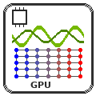

# PhysicsNeMo

Trains an [NVIDIA PhysicsNeMo](https://github.com/NVIDIA/physicsnemo) model on a
cluster, in the NGC PhysicsNeMo container, and serves the training live in
TensorBoard:

| Example | Model | Data |
|---|---|---|
| `darcy_fno` | Fourier neural operator: permeability field in, pressure field out | generated during training by PhysicsNeMo's Darcy2D solver |
| `darcy_transolver` | Transolver, a transformer neural operator, on the same problem | generated during training |
| `ldc_pinns` | physics-informed network for the lid-driven cavity: the Navier-Stokes residuals and the wall conditions are the loss | none |

None of them downloads a dataset. **My own script** runs any bash script in the
container instead, with the PhysicsNeMo examples at hand.

The run completes when the training finishes and **fails when it fails**. While it
runs, `tensorboard-<run slug>` (in `pw endpoints list` and on the run page) shows the
loss curves and the validation figures as they are written, and keeps showing them
after the run until you delete it.



## How it works

1. **preprocessing**, on the login node:
   - gets the PhysicsNeMo examples of the image's release (`examples/` of the
     `v1.1.0` tag, ~10 MB) into `<install directory>/physicsnemo/src/`, once, so the
     training node needs no access to GitHub;
   - with Singularity, builds the image into a SIF under
     `<install directory>/physicsnemo/containers/`, once;
   - writes the job script `train.sh`;
   - installs TensorBoard from conda-forge into
     `<install directory>/physicsnemo/miniforge` (once), starts it detached under
     `pw endpoints run` and waits until the endpoint answers through the platform
     ([`wait_for_endpoint`](../wait_for_endpoint/)). The training starts after that.
2. **training** submits `train.sh` through the shared
   [`script_submitter`](../script_submitter/), on the login node or as a SLURM/PBS
   job, and streams its output. The script checks the GPU (`nvidia-smi`), pulls the
   image with Docker on that node if it is not there yet (or uses the SIF), and runs
   `app/run-example.sh` in the container: it copies the example into `work/example`,
   applies the workflow's settings and trains. The output goes to `work/train.log`
   and the exit status to `train.exit`.
3. **results** writes `results/metrics.csv` and `results/summary.txt`, publishes the
   last value of every metric as an output, and fails the run when the training did
   not exit `0`, printing the tail of its output.

`stop_server_if_unhealthy` removes TensorBoard when preprocessing did not complete
(its health check failed, an install failed, or the run was cancelled first).

## Form options

| Group | Input | Meaning |
|---|---|---|
| `cluster` | `resource` | the cluster; TensorBoard runs on its login node |
| | `scheduler` | **No** (default): the login node, e.g. a single GPU server. **Yes**: a SLURM or PBS job on a compute node |
| | `gpus` | GPUs requested when scheduled: `--gres=gpu:N` (PBS `select=1:ngpus=N`), written ahead of the directives so a directive there overrides it; `0` requests none |
| | `slurm`, `pbs` | partition, walltime (default 2 h) and extra directives (`--cpus-per-task`, `--mem`, …) |
| `service` | `mode` | `example` or `custom` |
| | `example` | `darcy_fno`, `darcy_transolver` or `ldc_pinns` |
| | `epochs` | Darcy: pseudo-epochs of 2048 generated samples (default 20, about 30 minutes for the FNO on an A30; the examples' own 256 take hours). Validation, with a figure, runs every 4, and at the end of a shorter run |
| | `iterations` | LDC: training iterations (default 10000, the example's own); metrics every 1 %, a flow-field figure every 10 % |
| | `batch_size` | Darcy: `training.batch_size`, `0` keeps the example's (64 FNO, 8 Transolver) |
| | `overrides` | extra Hydra overrides for the example's `config.yaml`, space-separated, e.g. `training.resolution=128 scheduler.initial_lr=5e-4`; they come last and win |
| | `custom_script` | with `custom`: bash run in the container in `/workspace`; `${PHYSICSNEMO_SRC}/examples` holds the examples |
| | `device` | `gpu` (default; the job fails at once when the node has no working GPU) or `cpu` (no GPU even if there is one: shrink the problem) |
| | `gpu_index` | which GPU of the node, when not scheduled; a scheduled job uses its allocation |
| | `tensorboard` | serve TensorBoard as `tensorboard-<run slug>` (default yes) |
| `software` | `runtime` | `docker` (default) or `singularity` (Singularity or Apptainer) |
| | `image` | default `nvcr.io/nvidia/physicsnemo/physicsnemo:25.06` (PhysicsNeMo 1.1.0) |
| | `sif` | Singularity: a SIF built elsewhere; empty builds one |
| | `examples_ref` | git tag of the examples, `v` + the image's PhysicsNeMo version (default `v1.1.0`); the job warns when they differ |
| | `install_dir` | where the examples, the SIF and TensorBoard go, under `physicsnemo/` (default `${HOME}/pw/software`) |

The saved inputs **cpu_smoke_test** (Load saved inputs on the Execute page) shrink
the Darcy FNO to 64×64 fields and 64 samples per pseudo-epoch, for a cluster without
GPUs: a few minutes on 8 cores.

## The container

- **Docker**: the image is pulled on the node that trains, once per node (the 25.06
  image is 17 GB to download, 31 GB unpacked; a cloud compute node that is created for
  the job pulls it every time). `sudo docker` is used when the user is not in the
  `docker` group. The container runs as the workflow user, so everything it writes in
  the job directory is the user's, and it is named `physicsnemo-<run slug>`;
  cancelling the run removes it.
- **Singularity / Apptainer**: for clusters without Docker. The login node builds the
  SIF from the same image once (20–40 minutes, about 70 GB free needed in the install
  directory while building, 17 GB afterwards); the compute nodes read it from the
  shared filesystem. Or give the path of a SIF built elsewhere.

GPU: Docker gets `--gpus device=<n>`, Singularity `--nv`. On a scheduled job the GPU
is the allocation's (`SLURM_JOB_GPUS` for Docker, `CUDA_VISIBLE_DEVICES` otherwise);
on the login node the form's GPU index.

## TensorBoard

The examples log to the console (PhysicsNeMo's `LaunchLogger`), not to TensorBoard.
`app/tensorboard-server.py` follows `work/train.log` and turns every
`Epoch <N> Metrics: <name> = <value>, …` line into scalars (`train/loss`,
`train/Learning Rate`, `valid/Validation error`, `train/Epoch Time (s)`, …), and every
PNG figure written under `work/` into an image (`figures/validation_step`,
`figures/outputs_pc`); event files a custom script writes itself under `/workspace`
show up too. It runs from a small conda-forge environment on the login node, not
from the container, because the login node may have neither the image nor Docker.

**The endpoint outlives the run**: after the training ends, fails or is cancelled it
keeps showing what was logged, until `pw endpoints delete tensorboard-<run slug>`,
which stops it.

## Output and debugging

In the run's job directory (`~/pw/jobs/<run-slug>/` for CLI runs,
`~/pw/jobs/<workflow-name>/<run-number>/` for registered ones):

```
run.<slug>.out           the streamed job output: the host, the GPU, the container command, the training
train.exit               the training's exit status
work/train.log           the training output
work/example/            the example as run: checkpoints/, outputs/ (Hydra), figures (validation_step_*.png),
                         mlruns/ for the Transolver (it logs to MLflow offline)
work/tensorboard/        the TensorBoard events the server wrote
results/metrics.csv      every metric: namespace, step, metric, value
results/summary.txt      the last value of each metric, the checkpoints and figures
tensorboard.out          the TensorBoard server's output
```

```bash
pw workflows runs logs <slug>            # includes the streamed training output
pw workflows runs errors <slug>          # summary when the run failed
```

## Run from the CLI

```bash
pw workflows run "$PWD/workflows/physicsnemo/yamls/general.yaml" -i '{
  "cluster": {"resource": "pw://<user>/<gpu-server>", "scheduler": false},
  "service": {"mode": "example", "example": "darcy_fno", "epochs": 4, "device": "gpu"},
  "software": {"runtime": "docker"}}'
```

## Variants

`yamls/general.yaml` only: Docker is not available on the HPCMP and NOAA systems,
and the Singularity runtime there would need the image staged where their login
nodes reach (an HSP or NOAA variant would pass a prebuilt SIF).
